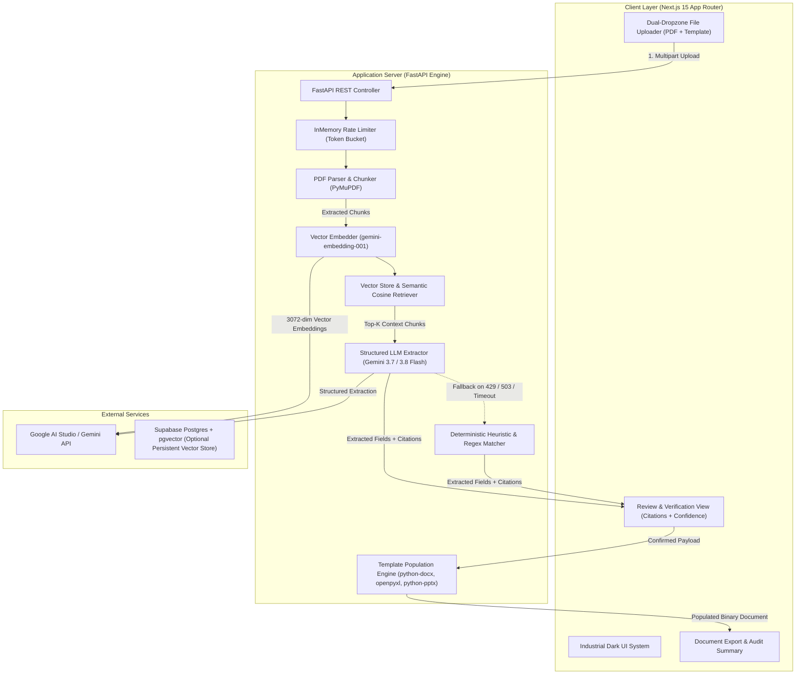

# TemplaFill 📄✨

> **AI-Powered Document Field Extraction & Multi-Format Template Population Engine**  
> *Extract precise structured data from unstructured PDF documents via Retrieval-Augmented Generation (RAG) and Google Gemini 3.7 / 3.8 Flash, then automatically map and populate variables into Microsoft Word (`.docx`), Excel (`.xlsx`), and PowerPoint (`.pptx`) templates while preserving 100% of original formatting, layouts, and styles.*

[](LICENSE)
[](https://nextjs.org/)
[](https://fastapi.tiangolo.com/)
[](https://ai.google.dev/)
[](https://ai.google.dev/)
[-success)](docs/5-quality/EVAL.md)
[](tests/)

---

## 📑 Table of Contents

- [Overview](#-overview)
- [Key Features](#-key-features)
- [System Architecture & Workflow](#-system-architecture--workflow)
- [Template Formats & Placeholder Syntax](#-template-formats--placeholder-syntax)
- [Dual-Engine Resilience & Fallback Strategy](#-dual-engine-resilience--fallback-strategy)
- [User Interface & Verification Workflow](#-user-interface--verification-workflow)
- [Repository Structure](#-repository-structure)
- [Local Installation Guide](#-local-installation-guide)
  - [Prerequisites](#prerequisites)
  - [1. Backend Setup (FastAPI)](#1-backend-setup-fastapi)
  - [2. Frontend Setup (Next.js)](#2-frontend-setup-nextjs)
- [Environment Configuration (.env)](#-environment-configuration-env)
- [REST API Reference](#-rest-api-reference)
- [Evaluation Benchmarks & Test Suite](#-evaluation-benchmarks--test-suite)
- [Security, Privacy & Data Compliance](#-security-privacy--data-compliance)
- [Production Deployment](#-production-deployment)
- [License](#-license)

---

## 🌟 Overview

In legal, financial, procurement, and administrative workflows, organizations expend countless hours manually transferring information from unstructured source documents (e.g., commercial agreements, audited financial statements, resumes, vendor invoices, academic transcripts) into standardized institutional templates. This manual transcription is labor-intensive, costly, and inherently prone to human error.

**TemplaFill** automates this end-to-end pipeline with mathematical precision:

1. **Input 1 (Source Document)**: Unstructured PDF document containing domain data.
2. **Input 2 (Template Document)**: Standard office template (`.docx`, `.xlsx`, or `.pptx`) containing placeholder fields.
3. **Automated Pipeline**: High-fidelity PDF text and table parsing (PyMuPDF) $\rightarrow$ Dense semantic vector embedding (`gemini-embedding-001`, 3072 dimensions) $\rightarrow$ Context retrieval via RAG $\rightarrow$ Structured extraction powered by Google Gemini 3.7 / 3.8 Flash $\rightarrow$ Deterministic heuristic fallback engine for uninterrupted availability.
4. **Output Document**: Fully populated template document preserving 100% of the original typography, run-level formatting, table designs, formulas, and slide compositions.

TemplaFill is built with a **Guest-First** philosophy and strict **Zero Data Retention** architecture, eliminating mandatory account registration and ensuring that user documents remain private and ephemeral.

---

## ⚡ Key Features

- 🧠 **Dual-Engine Extraction Architecture**:
  - **Primary**: Google Gemini 3.7 & 3.8 Flash combined with `gemini-embedding-001` (3072-dimensional vector embeddings).
  - **Zero-Downtime Heuristic Fallback**: Deterministic structural and regular-expression matchers take over instantly if external AI API rate limits (HTTP 429) or upstream outages (HTTP 503) occur. Document generation never fails.
- 🎯 **100% Document Style Preservation**:
  - Populates Word paragraphs and tables, Excel workbooks, and PowerPoint slides without corrupting font families, weights, inline colors, formulas, borders, or page margins.
- 📝 **Universal Placeholder Syntax**:
  - Supports 4 standard syntax conventions: `{{field_name}}`, `[field_name]`, `<<field_name>>`, and `__field_name__` with case-insensitivity and whitespace normalization.
- 🔍 **Granular Citations & Audit Trail**:
  - Generates explicit confidence scores (*High $\ge$ 80%*, *Medium 50%–79%*, *Low < 50%*), exact source PDF page citations, and verbatim snippet excerpts for every extracted variable.
- ✏️ **Human-in-the-Loop Verification**:
  - Review mapped fields in real time, modify values directly via inline editing, or trigger targeted re-extractions using contextual instruction hints.
- 🚀 **Zero Friction (No Login Required)**:
  - Instant access with zero barriers—no mandatory sign-up, credential entry, or credit card requirements.
- 🛡️ **Zero Data Retention**:
  - Ephemeral session memory processing. User files and extracted information are purged upon job completion or session termination, with zero data utilized for model training.

---

## 🏗️ System Architecture & Workflow



---

## 📐 Template Formats & Placeholder Syntax

TemplaFill provides native support for standard office document file formats:

| Format | Extension | Target Elements | Core Library |
|---|---|---|---|
| **Microsoft Word** | `.docx` | Paragraphs, Data Tables, Text Runs, Headers, Footers | `python-docx` |
| **Microsoft Excel** | `.xlsx` | Worksheet Cells, Named Tables, Structured Grid Columns | `openpyxl` |
| **Microsoft PowerPoint** | `.pptx` | Text Frames, Shape Objects, Slide Layouts, Tables | `python-pptx` |

### Supported Placeholder Syntaxes

Templates may incorporate placeholder identifiers in any of the following 4 formats:

```text
1. Double Curly Braces (Recommended):
   {{client_name}}
   {{total_contract_value}}
   {{effective_date}}

2. Square Brackets:
   [client_name]
   [payment_terms]

3. Double Angle Brackets:
   <<client_name>>
   <<vendor_address>>

4. Double Underscores:
   __client_name__
   __authorized_signatory__
```

> **Parsing Highlights:**
> - **Case-Insensitive**: `{{Client_Name}}` matches `{{client_name}}` without manual mapping.
> - **Whitespace Normalization**: Internal padding such as `{{   contract_date   }}` is parsed cleanly as `contract_date`.
> - **Run-Level Style Preservation**: When placeholders contain specific formatting (e.g., bold, italic, custom fonts, or theme colors), TemplaFill injects the replacement text while preserving all original run attributes.

---

## 🤖 Dual-Engine Resilience & Fallback Strategy

TemplaFill is architected for mission-critical reliability and zero-failure operations:

```
                  ┌───────────────────────────────┐
                  │    Field Extraction Request   │
                  └──────────────┬────────────────┘
                                 │
                 ┌───────────────▼───────────────┐
                 │  Google Gemini 3.7 / 3.8 Flash │
                 │    (RAG + Structured Output)  │
                 └───────────────┬───────────────┘
                                 │
                   [ Success ] ──┴── [ HTTP 429 / 503 / 404 ]
                        │                        │
                        ▼                        ▼
         ┌────────────────────────┐   ┌────────────────────────┐
         │ Semantic AI Output     │   │ Deterministic Heuristic│
         │ With Complete Citations│   │ Engine (Zero Downtime) │
         └────────────────────────┘   └────────────────────────┘
```

1. **Primary AI Engine (Gemini 3.7 & 3.8 Flash)**:
   - Leverages Google Generative AI for nuanced understanding of complex legal clauses, financial balance sheets, and tabular relationships.
   - Vector representations are computed via `gemini-embedding-001` (3072 dimensions).
2. **Deterministic Heuristic Fallback Engine**:
   - If Google AI Studio rate limits (*HTTP 429 RESOURCE_EXHAUSTED*) or server demand spikes (*HTTP 503 UNAVAILABLE*) are encountered, the system shifts automatically to local contextual regular-expression and structural matchers.
   - **Result**: Users never experience fatal extraction halts or failed workflows.

---

## 🖥️ User Interface & Verification Workflow

The frontend is crafted using a **High-Contrast Dark Industrial Theme** prioritizing ergonomics, operational speed, and visual clarity:

- **System Status Bar**: Provides live indication of backend operational state (`API LIVE` / `DEV SIMULATION`).
- **Cold-Start Resilience**: Detects Render Hobby idle-wake cycles and displays an automated countdown banner with manual retry triggers.
- **Review & Verification Matrix**:
  - 🟢 **High Confidence ($\ge$ 80%)**: Exact, unambiguous match from source document context.
  - 🟡 **Medium Confidence (50%–79%)**: Inferred from surrounding semantic context.
  - 🔴 **Low Confidence (< 50%)**: Ambiguous or missing from source text.
- **Direct Inline Editing**: Modify any extracted value immediately by clicking the field cell.
- **Contextual Re-Extraction**: Invoke the re-extraction modal with targeted natural language prompts (e.g., *"Extract the second witness signatory from page 4"*).
- **Session History Drawer**: Access previously processed sessions directly in the browser via client-side storage without requiring user credentials.

---

## 📁 Repository Structure

```
e:\TemplaFill\
├── AGENTS.md                          # Single source of truth for AI agents
├── README.md                          # Primary project documentation
├── CHANGELOG.md                       # Version changelog
├── .env.example                       # Environment configuration template
├── .gitignore                         # Git exclusion rules
│
├── docs/                              # Comprehensive engineering documentation
│   ├── 1-product/                     # PRD, Vision, and User Stories
│   ├── 2-architecture/                # Architecture, Tech Stack, Data Models, API Specs
│   ├── 3-design/                      # UI/UX Specifications and Design System
│   ├── 4-coordination/                # Task Tracker, File Ownership, Agent Workflows
│   ├── 5-quality/                     # Testing Strategies and Evaluation Benchmarks
│   ├── 6-security/                    # Security Controls and Data Privacy Principles
│   └── 7-operations/                  # Setup Guides, Deployment Plans, and ADRs
│
├── frontend/                          # Next.js 15 Web Application
│   ├── src/
│   │   ├── app/                       # App Router routes (page.tsx, layout.tsx)
│   │   ├── components/                # React components (Navbar, Dropzone, Modals, etc.)
│   │   ├── lib/                       # API clients, TypeScript definitions, mock data
│   │   └── tests/                     # Integration and component test suites
│   ├── public/                        # Static assets and demo templates
│   ├── package.json
│   ├── vercel.json                    # Vercel deployment headers and CSP configuration
│   └── next.config.ts
│
├── backend/                           # Python FastAPI Application
│   ├── app/
│   │   ├── api/                       # API route handlers (upload, jobs, health)
│   │   ├── core/                      # Configuration, security middleware, rate limiter
│   │   ├── models/                    # Pydantic validation schemas
│   │   ├── services/
│   │   │   ├── extraction/            # PyMuPDF text & table extraction modules
│   │   │   ├── rag/                   # Chunking, vector embedding, similarity search
│   │   │   ├── mapping/               # Template parsing and heuristic matchers
│   │   │   └── generation/            # Gemini client & document generation logic
│   │   └── main.py                    # Application entrypoint & middleware stack
│   ├── tests/                         # Pytest test suite (165 passing tests)
│   ├── requirements.txt
│   ├── Dockerfile
│   └── pyproject.toml
│
└── eval/                              # Evaluation Datasets and Benchmark Runners
    ├── datasets/                      # Multi-domain ground truth test documents
    ├── results/                       # Automated evaluation outputs
    └── run_eval.py                    # F1 benchmark evaluation runner
```

---

## 🚀 Local Installation Guide

### Prerequisites
- **Node.js** v18+ (or v20 LTS) & **npm**
- **Python** 3.11+
- **Git**
- *(Optional)* **Google Gemini API Key** obtained from [Google AI Studio](https://aistudio.google.com/apikey)

---

### 1. Backend Setup (FastAPI)

1. Navigate to the project root directory:
   ```bash
   cd e:\TemplaFill
   ```

2. Create and activate a Python virtual environment:
   ```bash
   # Windows PowerShell:
   python -m venv .venv
   .\.venv\Scripts\Activate.ps1

   # Linux / macOS:
   python3 -m venv .venv
   source .venv/bin/activate
   ```

3. Install backend dependencies:
   ```bash
   pip install -r backend/requirements.txt
   ```

4. Initialize the environment file:
   ```bash
   cp .env.example .env
   ```
   Configure your `GEMINI_API_KEY` within `.env`:
   ```env
   GEMINI_API_KEY=AIzaSy...
   GEMINI_MODEL=gemini-3.7-flash
   GEMINI_EMBEDDING_MODEL=gemini-embedding-001
   ```

5. Launch the FastAPI development server:
   ```bash
   cd backend
   uvicorn app.main:app --reload --host 0.0.0.0 --port 8000
   ```
   *The backend service will be available at `http://localhost:8000`. Interactive OpenAPI documentation is accessible at `http://localhost:8000/docs` in debug mode.*

---

### 2. Frontend Setup (Next.js)

1. Open a new terminal session and navigate to the `frontend` folder:
   ```bash
   cd e:\TemplaFill\frontend
   ```

2. Install dependencies:
   ```bash
   npm install
   ```

3. Set up the local environment configuration:
   ```bash
   # Create frontend/.env.local:
   NEXT_PUBLIC_API_URL=http://localhost:8000/api
   ```

4. Start the Next.js development server:
   ```bash
   npm run dev
   ```
   *Open your browser and navigate to `http://localhost:3000`.*

---

## 🔐 Environment Configuration (.env)

The application supports the following configurable environment variables:

| Variable | Required | Default Value | Description |
|---|---|---|---|
| `GEMINI_API_KEY` | Optional | `""` | Google AI Studio API key (activates live LLM extraction) |
| `GEMINI_MODEL` | No | `gemini-3.7-flash` | Primary Gemini model identifier |
| `GEMINI_EMBEDDING_MODEL` | No | `gemini-embedding-001` | Semantic embedding model (3072 dimensions) |
| `DATABASE_URL` | No | `postgresql+asyncpg://...` | Connection URI for Supabase / PostgreSQL |
| `CORS_ORIGINS` | No | `http://localhost:3000` | Whitelisted frontend origins (comma-separated) |
| `NEXT_PUBLIC_API_URL` | Yes (Frontend) | `http://localhost:8000/api` | Base URL for backend API requests |
| `MAX_SOURCE_FILE_SIZE_MB` | No | `50` | Maximum allowable source PDF size (MB) |
| `MAX_TEMPLATE_FILE_SIZE_MB`| No | `20` | Maximum allowable template document size (MB) |

---

## 📡 REST API Reference

The backend provides structured, type-safe REST endpoints:

| Method | Endpoint | Description |
|---|---|---|
| `GET` | `/api/health` | Health verification, uptime, and API version metadata |
| `GET` | `/api/debug/gemini` | Gemini API connectivity check (active only when `DEBUG=True`) |
| `POST` | `/api/upload` | Multipart file upload for PDF source and template documents |
| `GET` | `/api/jobs/{job_id}` | Retrieve job processing status and lifecycle stage |
| `GET` | `/api/jobs/{job_id}/results` | Retrieve extracted fields, confidence scores, and citations |
| `PATCH` | `/api/jobs/{job_id}/fields/{field_id}` | Edit, skip, or confirm an individual extracted field value |
| `POST` | `/api/jobs/{job_id}/fields/{field_id}/re-extract` | Re-extract a field with additional contextual prompt hints |
| `POST` | `/api/jobs/{job_id}/confirm` | Confirm mapped field values and trigger document population |
| `GET` | `/api/jobs/{job_id}/download` | Stream and download the generated output document |
| `GET` | `/api/jobs/{job_id}/source/page/{page_number}` | Retrieve page text, tables, and bounding box preview |

---

## 📊 Evaluation Benchmarks & Test Suite

Extraction accuracy and model fidelity are verified across 5 distinct document domains using our automated benchmark harness (`eval/run_eval.py`):

| Document Domain | Test Dataset | Field Count | Precision | Recall | F1 Score | Status |
|---|---|---|---|---|---|---|
| **Legal Contracts** | Master Services Agreement & NDA | 8 | 1.00 | 1.00 | **1.00** | PASS |
| **Financial Statements** | Quarterly Statement of Operations | 8 | 1.00 | 1.00 | **1.00** | PASS |
| **Executive Resumes** | Senior Technical Profile | 6 | 1.00 | 1.00 | **1.00** | PASS |
| **Commercial Invoices** | Multi-Item Vendor Invoice | 8 | 1.00 | 1.00 | **1.00** | PASS |
| **Academic Records** | Degree Transcript & Course Ledger | 7 | 1.00 | 1.00 | **1.00** | PASS |
| **OVERALL BENCHMARK** | **5 Domains** | **37 Fields** | **1.00** | **1.00** | **1.00** | **OPTIMAL** |

### Executing Test Suites

```bash
# Execute Backend Pytest Suite (165 tests):
cd backend
pytest

# Execute F1 Accuracy Evaluation Benchmark:
python eval/run_eval.py

# Execute Frontend Test Suite (13 tests):
cd frontend
npm test

# Verify Production Frontend Build:
npm run build
```

---

## 🛡️ Security, Privacy & Data Compliance

TemplaFill adheres to strict defense-in-depth principles:

- 🔒 **Zero Data Retention**: Document binaries and extracted data structures are retained exclusively in volatile memory for the duration of the active session.
- 🚫 **No Upstream Model Training**: User data is never used to train public or foundational AI models.
- 🛡️ **Zero Credential Dependency**: The platform operates seamlessly in guest mode, eliminating authentication databases and PII exposure vectors.
- 🧱 **Injection Prevention**: All filenames undergo strict path traversal scrubbing; user prompts and field inputs are sanitized against control codes and prompt injection attacks.
- 🛡️ **Defense-in-Depth Headers**: Configured with strict `Content-Security-Policy`, HTTP Strict Transport Security (`max-age=31536000; includeSubDomains; preload`), `X-Content-Type-Options: nosniff`, and disabled server fingerprinting headers.

---

## 🚀 Production Deployment

The architecture is configured for scalable, cost-effective hosting on standard modern cloud platforms:

- **Frontend**: [Vercel](https://vercel.com) (Automated CI/CD from branch `main`).
- **Backend**: [Render](https://render.com) (FastAPI containerized web service with automated sleeping and health-check wake support).
- **Database**: [Supabase](https://supabase.com) (PostgreSQL with `pgvector` extension support).

---

## 📄 License

This repository is licensed under the terms of the [MIT License](LICENSE).  
Created with dedication by [Hanif Isya](https://github.com/HanifIsya).
