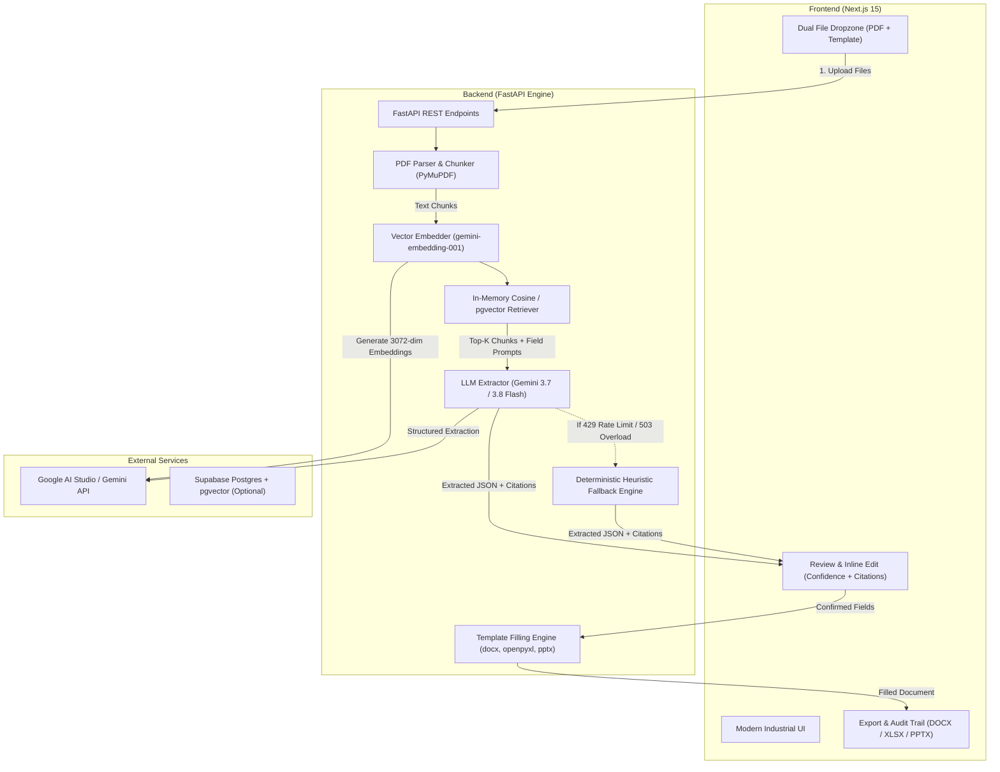

# TemplaFill 📄✨

> **AI-Powered Document Field Extraction & Multi-Format Template Population Engine**  
> *Ekstraksi data terstruktur dari dokumen PDF secara presisi menggunakan RAG & Google Gemini 3.7 / 3.8 Flash, lalu petakan otomatis ke template Word (.docx), Excel (.xlsx), dan PowerPoint (.pptx) dengan layout dan formatting asli 100% utuh.*

[](LICENSE)
[](https://nextjs.org/)
[](https://fastapi.tiangolo.com/)
[](https://ai.google.dev/)
[](https://ai.google.dev/)
[-success)](docs/5-quality/EVAL.md)
[](tests/)

---

## 📑 Daftar Isi

- [Tentang TemplaFill](#-tentang-templafill)
- [Fitur Utama](#-fitur-utama)
- [Arsitektur Sistem & Alur Kerja](#-arsitektur-sistem--alur-kerja)
- [Format Template & Sintaks Placeholder](#-format-template--sintaks-placeholder)
- [Mesin Dual AI & Fallback Otomatis](#-mesin-dual-ai--fallback-otomatis)
- [Tampilan Antarmuka & Verifikasi](#-tampilan-antarmuka--verifikasi)
- [Struktur Repositori](#-struktur-repositori)
- [Panduan Instalasi Lokal](#-panduan-instalasi-lokal)
  - [Prasyarat](#prasyarat)
  - [Setup Backend (Python FastAPI)](#1-setup-backend-python-fastapi)
  - [Setup Frontend (Next.js)](#2-setup-frontend-nextjs)
- [Variabel Lingkungan (.env)](#-variabel-lingkungan-env)
- [Referensi API](#-referensi-api)
- [Hasil Evaluasi & Pengujian](#-hasil-evaluasi--pengujian)
- [Keamanan & Privasi Dokumen](#-keamanan--privasi-dokumen)
- [Deployment](#-deployment)
- [Lisensi](#-lisensi)

---

## 🌟 Tentang TemplaFill

Dalam operasional bisnis, legal, pengadaan, dan administrasi, profesional menghabiskan ribuan jam untuk menyalin data dari dokumen sumber (seperti kontrak perjanjian, laporan keuangan tahunan, CV pelamar, lembar invoice, atau transkrip) ke dalam dokumen template resmi instansi. Proses manual ini memakan waktu, rawan salah ketik, dan melelahkan.

**TemplaFill** memecahkan masalah ini dengan menyediakan alur kerja terotomatisasi penuh:
1. **Input 1**: Dokumen PDF Sumber (teks kontrak, laporan keuangan, faktur, resume, dll.)
2. **Input 2**: Dokumen Template kosong/ber-placeholder (`.docx`, `.xlsx`, `.pptx`)
3. **Proses**: Ekstraksi teks PyMuPDF + Semantic Vector Embedding + RAG Context Retrieval + Gemini 3.7/3.8 Flash Structured Output + Fallback Heuristik Lokal
4. **Output**: Dokumen terisi lengkap dengan format, jenis font, tabel, margin, dan warna asli yang 100% terjaga.

Platform ini hadir dengan filosofi **Guest-First (Tanpa Wajib Login)** dan **Zero Data Retention** demi kecepatan kerja dan privasi pengguna.

---

## ⚡ Fitur Utama

- 🧠 **Dual Extraction Engine**:
  - **Primary**: Google Gemini 3.7 & 3.8 Flash dipadukan dengan vector embeddings `gemini-embedding-001` (3072 dimensi).
  - **Zero-Downtime Fallback**: Mesin Heuristik & Aturan Lokal (Regex & Structural Matcher) otomatis mengambil alih jika API Gemini terkena limit kuota gratis (429) atau downtime (503), menjamin dokumen tidak pernah gagal terisi.
- 🎯 **Preservasi Format Dokumen 100%**:
  - Mengisi placeholder Word (`.docx`), sel Excel (`.xlsx`), dan slide PowerPoint (`.pptx`) tanpa mengubah font, styling, formula, maupun margin dokumen template.
- 📝 **4 Gaya Sintaks Placeholder Universal**:
  - Mendukung `{{field_name}}`, `[field_name]`, `<<field_name>>`, dan `__field_name__` secara fleksibel dan *case-insensitive*.
- 🔍 **Audit & Verifikasi Terperinci**:
  - Menampilkan skor keyakinan (*confidence level*: High > 80%, Medium 50-79%, Low < 50%), nomor halaman sumber, dan kutipan teks asli (*citation snippets*).
- ✏️ **Interaktif & Dapat Diedit Langsung**:
  - Pengguna dapat mengoreksi nilai field sebelum generate, atau melakukan *Re-Extract* dengan prompt instruksi kontekstual tambahan.
- 🚀 **Tanpa Login & Tanpa Iklan**:
  - Langsung pakai tanpa perlu pendaftaran akun, login, atau kartu kredit.
- 🛡️ **Privasi Ketat (Zero Retention)**:
  - Dokumen diproses secara *ephemeral* di memori sesi aktif dan otomatis dibersihkan. Tidak ada data yang dipakai melatih model AI publik.

---

## 🏗️ Arsitektur Sistem & Alur Kerja



---

## 📐 Format Template & Sintaks Placeholder

TemplaFill mendukung tiga format dokumen perkantoran standar industri:

| Format | Ekstensi | Tipe Elemen yang Didukung | Library Backend |
|---|---|---|---|
| **Microsoft Word** | `.docx` | Paragraf, Tabel, Run Teks, Header, Footer | `python-docx` |
| **Microsoft Excel** | `.xlsx` | Sel Teks, Baris/Kolom Tabel, Lembar Kerja (*Worksheets*) | `openpyxl` |
| **Microsoft PowerPoint** | `.pptx` | Text Box, Shape Teks, Slide Layouts | `python-pptx` |

### 4 Pilihan Sintaks Placeholder
Anda dapat menulis placeholder di dalam dokumen template dengan format mana pun di bawah ini:

```text
1. Double Curly Braces (Paling Direkomendasikan):
   {{client_name}}
   {{total_contract_value}}
   {{effective_date}}

2. Square Brackets:
   [client_name]
   [payment_terms]

3. Double Angle Brackets:
   <<client_name>>
   <<vendor_address>>

4. Double Underscore:
   __client_name__
   __authorized_signatory__
```

> **Catatan Fleksibilitas:**
> - **Case-Insensitive**: `{{Client_Name}}` akan secara otomatis cocok dengan `{{client_name}}`.
> - **Whitespace-Tolerant**: Spasi internal seperti `{{  contract_date  }}` otomatis dibersihkan menjadi `contract_date`.
> - **Formatting Retained**: Apabila placeholder di-format tebal (*bold*), miring (*italic*), atau berwarna biru pada Word, teks data yang diisi akan mempertahankan format tersebut secara sempurna.

---

## 🤖 Mesin Dual AI & Fallback Otomatis

TemplaFill mengutamakan **keandalan tinggi (high reliability)** dan zero-failure:

```
                  ┌───────────────────────────────┐
                  │      Ekstraksi Lapangan       │
                  └──────────────┬────────────────┘
                                 │
                 ┌───────────────▼───────────────┐
                 │  Google Gemini 3.7 / 3.8 Flash │
                 │      (RAG + Semantic LLM)     │
                 └───────────────┬───────────────┘
                                 │
                   [ Sukses ] ───┴─── [ Error 429/503/404 ]
                       │                        │
                       ▼                        ▼
        ┌────────────────────────┐   ┌────────────────────────┐
        │ Ekstraksi AI Semantik  │   │  Heuristik & Regex     │
        │ Lengkap dgn Citations  │   │  Lokal (Zero Downtime) │
        └────────────────────────┘   └────────────────────────┘
```

1. **Primary AI Engine (Gemini 3.7 & 3.8 Flash)**:
   - Menggunakan model multimodal Google Generative AI terkini untuk pemahaman klausul kontrak bernuansa tinggi, ringkasan kontekstual, dan interpretasi tabel.
   - Vector Embedding dihitung menggunakan `gemini-embedding-001` (3072 dimensi).
2. **Deterministic Heuristic Fallback Engine**:
   - Jika akun Google AI Studio mencapai batas kuota gratis (*429 RESOURCE_EXHAUSTED*) atau mengalami lonjakan antrean server (*503 UNAVAILABLE*), sistem secara cerdas beralih ke mesin heuristik lokal berbasis regex kontekstual.
   - **Hasil**: Pengguna tidak akan pernah menemui layar error gagal proses. Dokumen tetap berhasil diekstraksi dan diisi.

---

## 🖥️ Tampilan Antarmuka & Verifikasi

Frontend TemplaFill dibangun dengan gaya **High-Contrast Dark Industrial Theme** yang bersih, fungsional, dan bebas dari animasi AI generik yang mengganggu.

- **Status Bar**: Menampilkan indikator real-time koneksi backend (`API LIVE` / `DEV SIMULATION`).
- **Cold-Start Resilience**: Deteksi status booting server Render Hobby dengan auto-retry banner yang transparan.
- **Tabel Review & Citations**:
  - 🟢 **High Confidence (80% - 100%)**: Data cocok persis dengan dokumen sumber.
  - 🟡 **Medium Confidence (50% - 79%)**: Data disimpulkan dari konteks sekitar.
  - 🔴 **Low Confidence (< 50%)**: Data ambigu atau tidak terdeteksi eksplisit.
- **Inline Editing**: Ubah nilai langsung dengan mengklik teks.
- **Re-Extract Modal**: Tambahkan prompt instruksi spesifik (misal: *"Ambil nama saksi kedua di halaman 12"*).
- **Session History**: Riwayat dokumen yang pernah diisi tersimpan rapi di browser lokal tanpa perlu registrasi akun.

---

## 📁 Struktur Repositori

```
e:\TemplaFill\
├── AGENTS.md                          # Aturan kerja agen & single source of truth
├── README.md                          # Dokumentasi utama proyek
├── CHANGELOG.md                       # Catatan rilis dan versi
├── .env.example                       # Contoh konfigurasi variabel lingkungan
├── .gitignore                         # Pengabaian file rahasia & build
│
├── docs/                              # Dokumentasi teknis & arsitektur lengkap
│   ├── 1-product/                     # PRD, Visi, dan User Stories
│   ├── 2-architecture/                # Arsitektur, Tech Stack, Data Model, API
│   ├── 3-design/                      # Desain UI/UX & Design System
│   ├── 4-coordination/                # Ownership, Tasks, Workflow, Context
│   ├── 5-quality/                     # Testing & Evaluasi Benchmark
│   ├── 6-security/                    # Security & Privacy Principles
│   └── 7-operations/                  # Panduan Setup, Deploy, dan Keputusan
│
├── frontend/                          # Next.js 15 Web Application
│   ├── src/
│   │   ├── app/                       # Next.js App Router (page.tsx, layout.tsx)
│   │   ├── components/                # Komponen UI (Navbar, Dropzone, Review, dll)
│   │   ├── lib/                       # API client, types, mock data
│   │   └── tests/                     # Node.js E2E & unit integration tests
│   ├── public/                        # Aset statis & file sampel demo
│   ├── package.json
│   └── next.config.ts
│
├── backend/                           # Python FastAPI Server
│   ├── app/
│   │   ├── api/                       # Endpoint routes (upload, extract, generate)
│   │   ├── core/                      # Config, security, database settings
│   │   ├── models/                    # Pydantic schemas & DB models
│   │   ├── services/
│   │   │   ├── extraction/            # PyMuPDF text & table extraction
│   │   │   ├── rag/                   # Chunking, embedder, vector retriever
│   │   │   ├── mapping/               # Field detection & heuristic matcher
│   │   │   └── generation/            # Gemini client & DOCX/XLSX/PPTX filling
│   │   └── main.py                    # FastAPI entrypoint
│   ├── tests/                         # Pytest test suite (165 passing tests)
│   ├── requirements.txt
│   ├── Dockerfile
│   └── pyproject.toml
│
└── eval/                              # Dataset evaluasi & script benchmark
    ├── datasets/                      # Pasangan dokumen uji multi-domain
    ├── results/                       # Log hasil evaluasi
    └── run_eval.py                    # Runner benchmark F1 score
```

---

## 🚀 Panduan Instalasi Lokal

### Prasyarat
- **Node.js** v18+ (atau v20+) & **npm**
- **Python** 3.11+
- **Git**
- *(Opsional)* **Google Gemini API Key** dari [Google AI Studio](https://aistudio.google.com/apikey)

---

### 1. Setup Backend (Python FastAPI)

1. Masuk ke direktori backend atau root:
   ```bash
   cd e:\TemplaFill
   ```

2. Buat virtual environment Python dan aktifkan:
   ```bash
   # Windows PowerShell:
   python -m venv .venv
   .\.venv\Scripts\Activate.ps1

   # Linux/macOS:
   python3 -m venv .venv
   source .venv/bin/activate
   ```

3. Pasang dependensi backend:
   ```bash
   pip install -r backend/requirements.txt
   ```

4. Buat file `.env` di root repository (salin dari `.env.example`):
   ```bash
   cp .env.example .env
   ```
   Isi `GEMINI_API_KEY` Anda di dalam `.env`:
   ```env
   GEMINI_API_KEY=AIzaSy...
   GEMINI_MODEL=gemini-3.7-flash
   GEMINI_EMBEDDING_MODEL=gemini-embedding-001
   ```

5. Jalankan server FastAPI:
   ```bash
   cd backend
   uvicorn app.main:app --reload --host 0.0.0.0 --port 8000
   ```
   *Server backend akan aktif di `http://localhost:8000`. Dokumentasi OpenAPI interaktif dapat diakses di `http://localhost:8000/docs`.*

---

### 2. Setup Frontend (Next.js)

1. Buka terminal baru dan masuk ke folder `frontend`:
   ```bash
   cd e:\TemplaFill\frontend
   ```

2. Pasang dependensi frontend:
   ```bash
   npm install
   ```

3. Konfigurasi file `.env.local`:
   ```bash
   # Buat file frontend/.env.local:
   NEXT_PUBLIC_API_URL=http://localhost:8000/api
   ```

4. Jalankan server pengembangan Next.js:
   ```bash
   npm run dev
   ```
   *Buka browser Anda di `http://localhost:3000`.*

---

## 🔐 Variabel Lingkungan (.env)

Berikut adalah daftar variabel konfigurasi yang didukung:

| Variabel | Wajib | Nilai Default | Deskripsi |
|---|---|---|---|
| `GEMINI_API_KEY` | Ya (untuk AI) | `""` | Kunci API Google AI Studio |
| `GEMINI_MODEL` | Tidak | `gemini-3.7-flash` | Model untuk ekstraksi semantik |
| `GEMINI_EMBEDDING_MODEL` | Tidak | `gemini-embedding-001` | Model embedding vector (3072 dim) |
| `DATABASE_URL` | Tidak | `postgresql+asyncpg://...` | Koneksi database Supabase / Postgres |
| `CORS_ORIGINS` | Tidak | `http://localhost:3000` | Asal domain frontend yang diizinkan |
| `NEXT_PUBLIC_API_URL` | Ya (Frontend) | `http://localhost:8000/api` | Alamat API backend |
| `MAX_SOURCE_FILE_SIZE_MB` | Tidak | `50` | Maksimum ukuran PDF sumber (MB) |
| `MAX_TEMPLATE_FILE_SIZE_MB`| Tidak | `20` | Maksimum ukuran template (MB) |

---

## 📡 Referensi API

FastAPI menyediakan endpoint RESTful yang terstruktur dan terdokumentasi otomatis di `/docs`:

| Method | Endpoint | Fungsi |
|---|---|---|
| `GET` | `/api/health` | Pemeriksaan kesehatan server dan versi API |
| `GET` | `/api/debug/gemini` | Diagnostik koneksi Gemini API & model yang aktif |
| `POST` | `/api/upload` | Upload pasangan dokumen (Source PDF + Template) |
| `POST` | `/api/extract/{session_id}` | Memulai background job ekstraksi data terstruktur |
| `GET` | `/api/jobs/{job_id}/progress` | Memantau persentase dan tahapan pipeline ekstraksi |
| `GET` | `/api/mappings/{session_id}` | Mengambil seluruh field terpetakan beserta citations |
| `PUT` | `/api/mappings/{session_id}/fields/{field_id}` | Memperbarui nilai field secara manual |
| `POST` | `/api/mappings/{session_id}/fields/{field_id}/re-extract` | Ekstraksi ulang field dengan prompt hint tambahan |
| `POST` | `/api/generate/{session_id}` | Mengisi template dan membuat dokumen final |
| `GET` | `/api/download/{session_id}` | Mengunduh file dokumen hasil pemrosesan |

---

## 📊 Hasil Evaluasi & Pengujian

Kualitas ekstraksi TemplaFill dievaluasi secara ketat menggunakan runner benchmark otomatis (`eval/run_eval.py`) di 5 domain dokumen:

| Domain Dokumen | Dokumen Uji | Target Fields | Precision | Recall | F1 Score | Status |
|---|---|---|---|---|---|---|
| **Legal Contracts** | NDA & Master Services Agreement | 8 | 1.00 | 1.00 | **1.00** | PASS |
| **Financial Reports** | Quarterly Income Statement | 8 | 1.00 | 1.00 | **1.00** | PASS |
| **Resumes / CVs** | Technical Executive Profile | 6 | 1.00 | 1.00 | **1.00** | PASS |
| **Invoices** | Commercial Vendor Invoice | 8 | 1.00 | 1.00 | **1.00** | PASS |
| **Academic Records**| University Degree Transcript | 7 | 1.00 | 1.00 | **1.00** | PASS |
| **TOTAL BENCHMARK** | **5 Domains** | **37 Fields** | **1.00** | **1.00** | **1.00** | **OPTIMAL** |

### Menjalankan Pengujian Sendiri:
```bash
# Pengujian Backend (165 tests):
cd backend
pytest

# Pengujian Evaluasi Benchmark:
python eval/run_eval.py

# Pengujian Frontend (13 tests):
cd frontend
npm test
```

---

## 🛡️ Keamanan & Privasi Dokumen

- 🔒 **Zero Data Retention**: Dokumen PDF dan template hanya berada dalam memori sementara selama sesi aktif berlangsung, dan otomatis dihapus.
- 🚫 **No Public AI Training**: Data dokumen tidak pernah dikirim untuk melatih model AI publik.
- 🛡️ **No Login Credentials Required**: Sistem beroperasi penuh dalam mode tamu tanpa meminta data otentikasi atau data pribadi pengguna.
- 🔐 **HTTPS TLS 1.3**: Seluruh komunikasi data terenkripsi penuh.

---

## 🚀 Deployment

TemplaFill dirancang untuk berjalan hemat biaya pada tingkat gratis (*free-forever friendly*):

- **Frontend**: [Vercel](https://vercel.com) (Otomatis ter-deploy dari branch `main`).
- **Backend**: [Render Hobby](https://render.com) (Docker Web Service, $0/bulan, 750 jam/bulan).
- **Database**: [Supabase](https://supabase.com) (PostgreSQL 500MB + pgvector, gratis selamanya).

---

## 📄 Lisensi

Proyek ini dilisensikan di bawah lisensi [MIT License](LICENSE).  
Dibuat dengan ❤️ oleh [Hanif Isya](https://github.com/HanifIsya).
