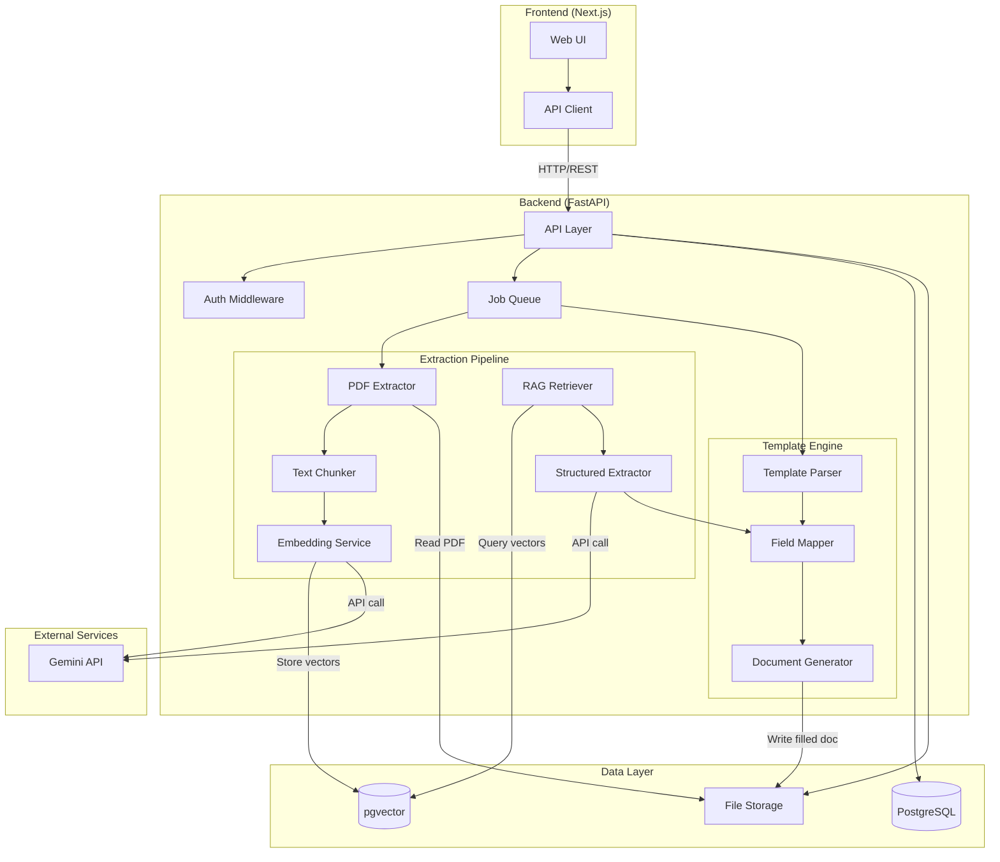
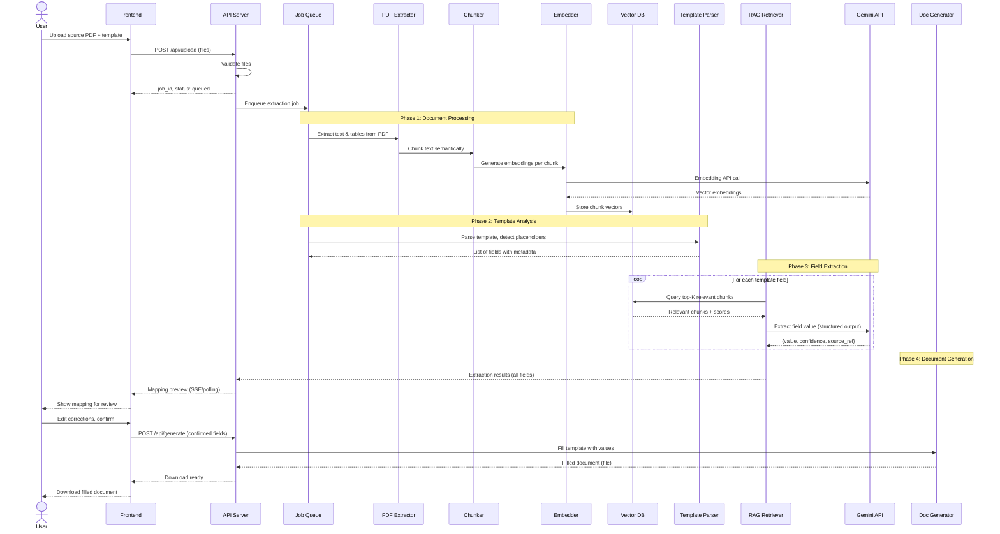
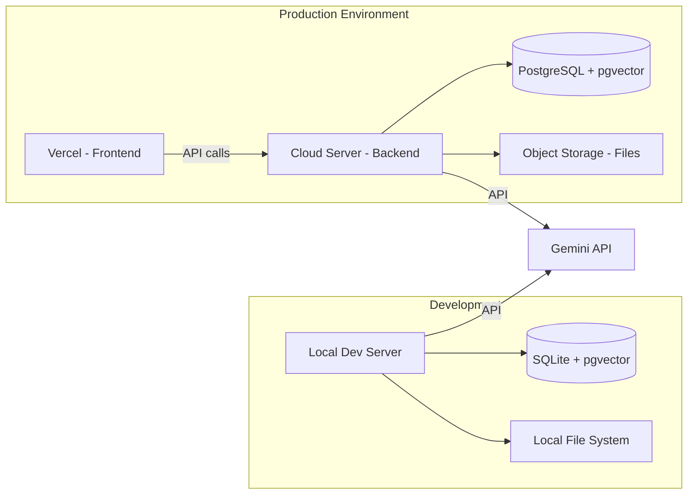

# System Architecture

## Overview

TemplaFill follows a **client-server architecture** with a Next.js frontend, Python FastAPI backend, and a RAG-based AI extraction pipeline powered by Gemini API.

---

## High-Level Architecture

---

## Data Flow: End-to-End Processing

---

## Component Details

### 1. PDF Extractor (`backend/app/services/extraction/`)

**Responsibility**: Extract raw text and tables from uploaded PDFs.

| Sub-component | Library | Purpose |
|---------------|---------|---------|
| Text Extractor | PyMuPDF (fitz) | Fast text extraction with position data |
| Table Extractor | pdfplumber | Structured table extraction |
| Metadata Extractor | PyMuPDF | Page count, title, author, creation date |
| Layout Analyzer | pdfplumber | Detect headers, footers, page numbers |

**Output**: Structured document object with pages, paragraphs, tables, and metadata.

### 2. Text Chunker (`backend/app/services/rag/chunker.py`)

**Responsibility**: Split extracted text into semantically meaningful chunks for embedding.

**Strategy**: Recursive character splitting with semantic awareness:
- Primary split: section headers / double newlines
- Secondary split: paragraphs / single newlines
- Tertiary split: sentence boundaries
- Chunk size: 500-1000 tokens with 100-token overlap
- Each chunk retains metadata: source page number, position, preceding header

### 3. Embedding Service (`backend/app/services/rag/embedder.py`)

**Responsibility**: Convert text chunks to vector embeddings using Gemini Embedding API.

| Parameter | Value |
|-----------|-------|
| Model | `text-embedding-004` (Gemini) |
| Dimensions | 768 |
| Batch size | 100 chunks per API call |
| Rate limiting | Respect Gemini free tier limits (15 RPM) |

### 4. RAG Retriever (`backend/app/services/rag/retriever.py`)

**Responsibility**: Given a field query, retrieve the most relevant chunks.

**Strategy**:
1. Convert field name/description to query embedding
2. Cosine similarity search in pgvector (top-K, K=5)
3. Optional: reranking with cross-encoder or LLM-based scoring
4. Return top chunks with relevance scores

### 5. Structured Extractor (`backend/app/services/generation/extractor.py`)

**Responsibility**: Use Gemini to extract precise field values from retrieved chunks.

**Approach**:
- Input: field name + description + top-K relevant chunks
- Output: JSON with `{value, confidence, source_page, source_text}`
- Use Gemini's structured output (JSON schema) for reliable parsing
- System prompt enforces: "Only extract data explicitly stated in the provided context. If the data is not found, return null."

### 6. Template Parser (`backend/app/services/mapping/parser.py`)

**Responsibility**: Parse template files and detect placeholder fields.

| Format | Library | Detection Strategy |
|--------|---------|-------------------|
| .docx | python-docx | Regex scan for `{{...}}`, `{...}`, `[...]`, `<<...>>`, `__...__` in paragraphs, tables, headers, footers |
| .xlsx | openpyxl | Regex scan across all cells in all sheets |
| .pptx | python-pptx | Regex scan in all text frames across all slides |

### 7. Field Mapper (`backend/app/services/mapping/mapper.py`)

**Responsibility**: Map extracted values to template placeholder fields.

**Logic**:
1. Match extracted field names to template placeholders (fuzzy matching)
2. Handle synonyms / aliases (e.g., "nama" ↔ "name" ↔ "full_name")
3. Apply type formatting (dates, numbers, currency)
4. Track unmapped fields (fields with no extracted value)

### 8. Document Generator (`backend/app/services/mapping/generator.py`)

**Responsibility**: Produce the final filled document.

**Process**:
1. Clone the original template file
2. Replace all placeholders with their mapped values
3. Preserve all original formatting (fonts, styles, colors, layouts)
4. Generate extraction summary report (optional, appended or separate file)

---

## Infrastructure Architecture

---

## Error Handling Strategy

| Error Type | Handling |
|-----------|----------|
| File upload fails | Retry with exponential backoff, show user-friendly error |
| PDF extraction fails | Log error, notify user, suggest re-upload |
| Gemini API rate limit | Queue with backoff, respect 15 RPM limit |
| Gemini API error | Retry up to 3 times, fallback to error state |
| Vector DB unavailable | Retry connection, degrade gracefully |
| Template parsing fails | Show detected format, ask user to verify placeholder format |
| Field extraction returns null | Mark as "Not Found", don't hallucinate |

---

## Security Architecture

See [SECURITY.md](../6-security/SECURITY.md) for full details.

**Key points**:
- All file uploads scanned for malware
- Files encrypted at rest (AES-256)
- All API communication over HTTPS (TLS 1.3)
- API key for Gemini stored in environment variables, never in code
- User documents auto-deleted after 24 hours
- No document content is logged or stored beyond processing
