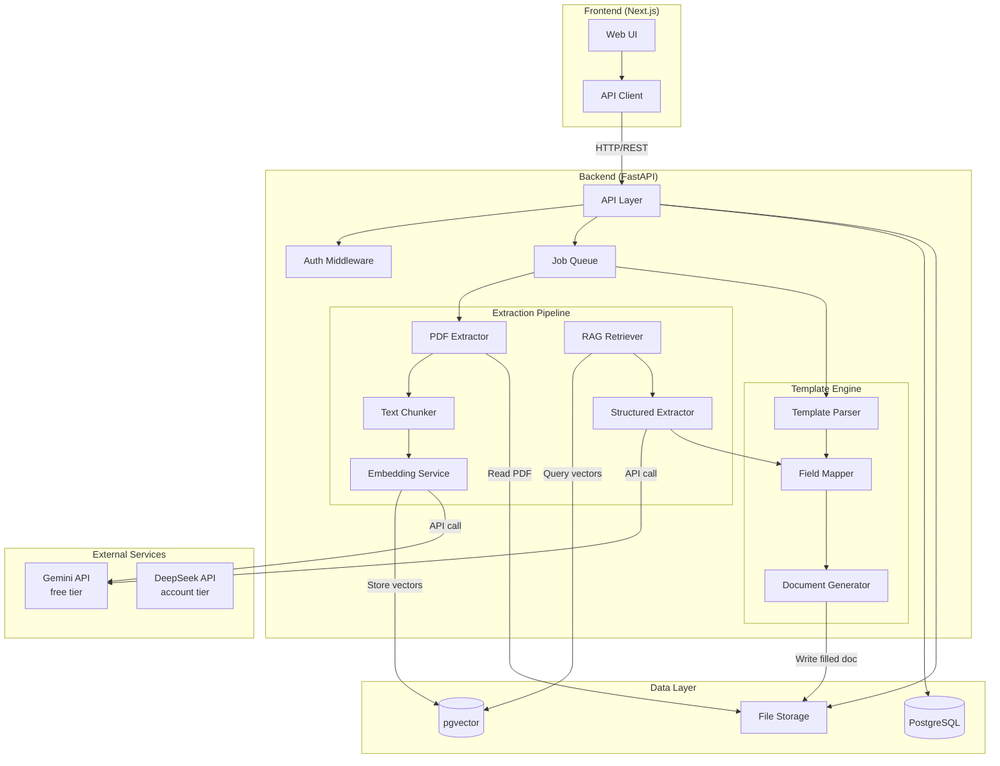
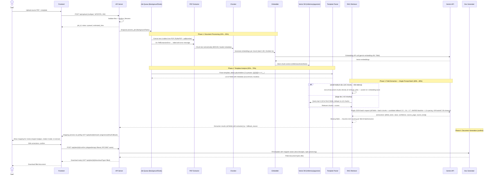
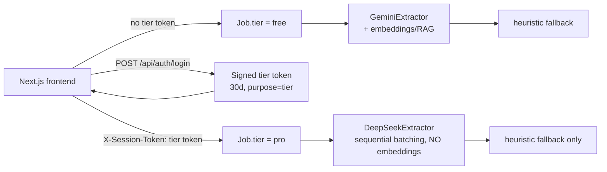
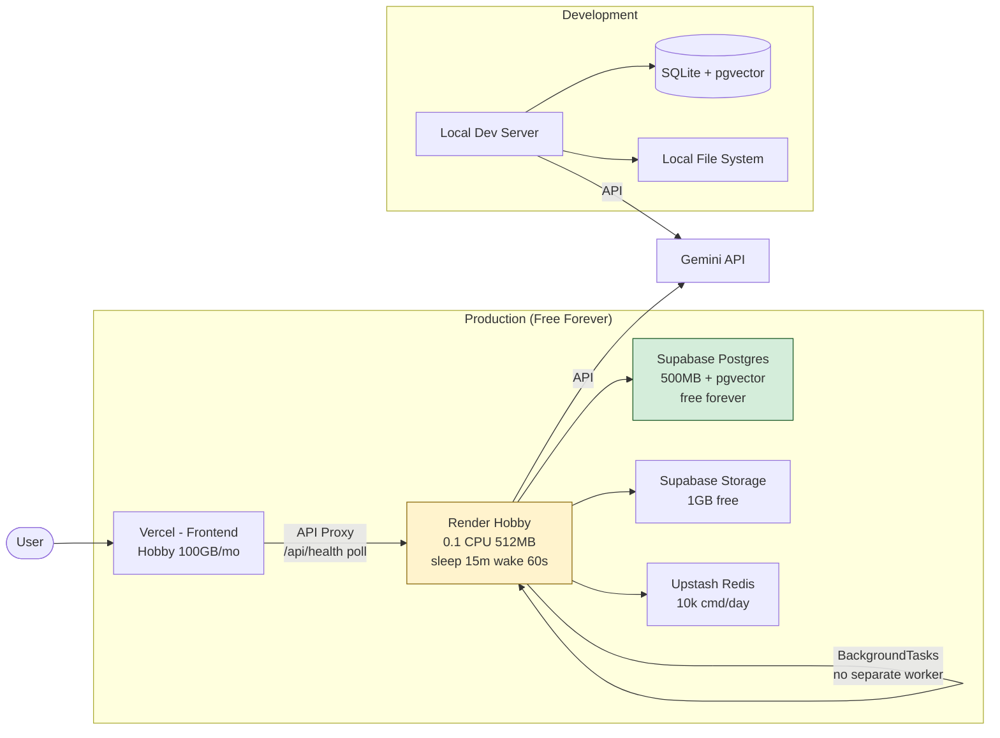

# System Architecture

## Overview

TemplaFill follows a **client-server architecture** with a Next.js frontend, Python FastAPI backend, and a RAG-based AI extraction pipeline powered by Gemini API.

---

## High-Level Architecture

---

## Data Flow: End-to-End Processing

---

## Component Details

### 1. PDF Extractor (`backend/app/services/extraction/`)

**Responsibility**: Extract raw text and tables from uploaded PDFs.

| Sub-component | Library | Purpose |
|---------------|---------|---------|
| Text Extractor | PyMuPDF (fitz) | Fast text extraction with position data |
| Table Extractor | pdfplumber | Structured table extraction |
| Metadata Extractor | PyMuPDF | Page count, title, author, creation date |
| Layout Analyzer | pdfplumber | Detect headers, footers, page numbers |

**Output**: Structured document object with pages, paragraphs, tables, and metadata.

### 2. Text Chunker (`backend/app/services/rag/chunker.py`)

**Responsibility**: Split extracted text into semantically meaningful chunks for embedding.

**Strategy**: Recursive character splitting with semantic awareness:
- Primary split: section headers / double newlines
- Secondary split: paragraphs / single newlines
- Tertiary split: sentence boundaries
- Chunk size: 500-1000 tokens with 100-token overlap
- Each chunk retains metadata: source page number, position, preceding header

### 3. Embedding Service (`backend/app/services/rag/embedder.py`)

**Responsibility**: Convert text chunks to vector embeddings using Gemini Embedding API (with legacy sanitization).

| Parameter | Value | Notes |
|-----------|-------|-------|
| Model | `gemini-embedding-001` (sanitized from legacy `text-embedding-004` at `embedder.py:107`) | `get_settings().gemini_embedding_model` default `gemini-embedding-001` |
| Dimensions | 768 | `EMBEDDING_DIMS`; 3072-capable model truncated to 768 for InMemory/pgvector `VECTOR(768)` + fake embeddings |
| Batch size | 100 chunks per API call | `EMBEDDING_BATCH_SIZE` |
| Rate limiting | Respect Gemini free tier limits (15 RPM via 4s `MIN_INTERVAL_S`) | `_last_call_ts` throttling + fake fallback on API error |

**Fake fallback**: `_fake_embedding()` hashes text → seeded `Random` uniform vector normalized to unit length, with keyword bias on first 32 dims — deterministic and offline-safe, so 167 tests + `eval/run_eval.py` pass without `GEMINI_API_KEY`.

### 4. RAG Retriever (`backend/app/services/rag/retriever.py`)

**Responsibility**: Given a field query, retrieve the most relevant chunks.

**Strategy**:
1. Convert field name/description to query embedding
2. Cosine similarity search in pgvector (top-K, K=5)
3. Optional: reranking with cross-encoder or LLM-based scoring
4. Return top chunks with relevance scores

### 5. Structured Extractor (`backend/app/services/generation/extractor.py`)

**Responsibility**: Use Gemini to extract precise field values from retrieved chunks — single-prompt batch with resilient candidate fallback, plus deterministic `FakeExtractor` for offline/tests.

**Approach** (ADR-013/014/015 + ADR-017 embedding bypass):

- **Batch path** (`extractor.py:430` `extract_batch`): Input is `fields: [{field_name, description}]` + chunk texts (≤15 all-chunks shortcut or ≤12 deduped) + `source_pages`. Builds one JSON schema prompt (`_build_batch_prompt`) listing all fields → single `GenerateContentConfig(response_mime_type="application/json")` → parses `{"extractions": [...]}`. On missing fields, per-field `FakeExtractor` recovery (`extracted_by="heuristic"`, `fallback_reason="Field missing in Gemini response"`); `last_engine_used` is `hybrid` if any recovered. `JobManager.process_job` (`manager.py:250`) calls this once per document (not 1-per-field), cutting API calls by >90%.
- **Chunk selection optimization** (`manager.py:224`): `if len(chunks) ≤15` → `batch_chunks = chunks` (0 embedding retriever calls) for small-medium docs (~6 pages, 51 fields) to avoid `51× retrieve_for_field` → `51× embed` 15 RPM burst (root cause of 0 output tokens in user screenshot). Else sparse probe `first 8 fields × top_k=3 → ≤12 deduped` (8 embedding calls, still under burst). Validated `51/51 extracted, confidence 1.0` on `Test source/*` with batch.
- **Single-field path** (`extractor.py:355` `extract`): used by `PATCH /fields/{id}` `re_extract` with `hint` appended as `field_description` + top-5 reranked chunks.
- **Resilience** (`_call_gemini_with_fallback` + `_throttle_call` + `_call_gemini_rest`): Candidate list `self.model, gemini-3.5-flash, gemini-3.6-flash, gemini-3.5-flash-lite, gemini-3.7-flash` (reordered to prefer `3.5` on free tier) deduped via `_BLACKLISTED_MODELS`; `404→blacklist+advance`; daily quota `limit:20 / RESOURCE_EXHAUSTED per day→blacklist` without sleep; `503→blacklist+advance` (`extractor.py:335`) instead of retry; `429→1.2s pacing + 2.0s×attempt backoff` (2 attempts/candidate, `extractor.py:341`). `_call_gemini` now has `_call_gemini_rest` fallback (`httpx` 60s + `urllib` sync executor) when `_client is None`, and both SDK+REST paths have `35s` `asyncio.wait_for` timeout. Every failure path sets `extracted_by="heuristic"` + `fallback_reason` + `source_text` prefix `[AI_ERROR: ...]`. `use_fake` no longer requires `_HAS_GENAI` (`extractor.py:204` `not bool(api_key)` only).
- **Model sanitization**: `__init__` rewrites legacy `gemini-2.0-flash-exp/1.5-flash/1.5-pro/2.5-flash` → `gemini-3.6-flash` (`extractor.py:199`).
- **Provenance**: `ExtractionResult.extracted_by` (`gemini|heuristic`) + `fallback_reason` propagated to `FieldResult` (`jobs/models.py:53`) and surfaced via `GET /api/jobs/{id}/results` `engine_used/hasFallback/fallback_reason` → frontend badges + banner + toast (`page.tsx:235`).
- System prompt invariant: *“Only extract data explicitly stated in the provided context. If the data is not found, return null.”* — enforced in both `_build_prompt` and `_build_batch_prompt` to prevent hallucination; `_fake` path uses term-scoring + distinctive guard (≥0.5, `0.85` for distinctive terms) to mirror the same behavior for eval 1.00 PASS.

### 6. Template Parser (`backend/app/services/mapping/parser.py`)

**Responsibility**: Parse template files and detect placeholder fields (5 syntaxes, priority-ordered).

| Format | Library | Detection Strategy |
|--------|---------|-------------------|
| .docx | python-docx | Regex scan for `{{...}}`, `{...}`, `[...]`, `<<...>>`, `__...__` (`_PLACEHOLDER_PATTERNS`) in paragraphs, tables, headers/footers/tables per section, dedup via `used_spans` + `_aggregate_fields` |
| .xlsx | openpyxl | Regex scan across all cells in all sheets (`cell.coordinate` location) |
| .pptx | python-pptx | Regex scan in all text frames + tables across all slides, plus `msoGroup` (shape_type 6) recursion |

Detection: case-insensitive, whitespace-normalized (`_normalize_field_name` replaces `[\s.\-]+` → `_`), skips numeric-only placeholders, tracks `occurrences` and `location`; warning if `0 placeholders` or `field_name>50 chars`.

### 7. Field Mapper (`backend/app/services/mapping/mapper.py`)

**Responsibility**: Map extracted values to template placeholder fields.

**Logic**:
1. Match extracted field names to template placeholders (fuzzy matching)
2. Handle synonyms / aliases (e.g., "nama" ↔ "name" ↔ "full_name")
3. Apply type formatting (dates, numbers, currency)
4. Track unmapped fields (fields with no extracted value)

### 8. Document Generator (`backend/app/services/mapping/generator.py`)

**Responsibility**: Produce the final filled document without brace corruption (ADR-017).

**Process**:
1. Clone the original template file (docx/xlsx/pptx) in memory
2. Build `direct` (raw `{{x}}→value`) + `normalized_to_value` (`x→value`) via `_build_replacement_map` (`generator.py:34`) feeding keys through `_find_placeholders` + `_normalize_field_name`
3. Replace atomically via `_replace_in_text` (`generator.py:61`): scans `_find_placeholders` sorted by `len(raw)` descending and replaces whole enclosed `raw` with `direct_map[raw]` or `norm_map[norm]`, then direct keys. This fixes the prior bug where `nomor_kontrak→SPK/0847` left `{{SPK/0847}}`; now `{{nomor_kontrak}}→SPK/0847` cleanly.
4. Preserve formatting: docx saves `first_run` bold/italic/underline/color/name/size (`generator.py:143`), xlsx keeps cell style on `cell.value` change, pptx saves first run font via `text_frame` (`generator.py:226`). Validated `Test source/target_* → filled: contains SPK true, {{SPK}} false, {{nomor}} false`.
5. Generate extraction summary report (optional, appended or separate file — `GET /download?type=summary` `501` stub, `jobs.py:310`)

---

## Tier System Architecture (Phase 6)

TemplaFill runs two provider paths selected by `Job.tier`. Full design in
[TIER_ARCHITECTURE.md](./TIER_ARCHITECTURE.md); the key points:

- **Free path** (`tier:"free"`): unchanged Gemini extraction + `gemini-embedding-001`
  RAG, capped at **5 jobs/day/IP**.
- **Account path** (`tier:"pro"`): DeepSeek `deepseek-flash` with **no embeddings**
  (retrieval bypassed via sequential chunk batching). **Hard rule: the pro path
  never calls a Google endpoint** — enforced by tests with Gemini mocked to raise.
- On failure the account path falls back to the local heuristic engine only, never
  to Gemini.
- Tier tokens carry `purpose:"tier"` so they are mutually invalid with per-job
  tokens (`purpose:"job"`).
- History/results are stored in the browser (`tf_history` in `localStorage`); the
  backend keeps documents in RAM only (≤24h TTL).

---

## Infrastructure Architecture — Free-Forever Choice: Vercel + Render Hobby + Supabase

**Notes:**
- Render Hobby `$0` (750h/mo, no CC) sleeps after 15 min idle; cold start ~60s handled via `frontend/src/components/BackendWakingBanner.tsx:1` + `frontend/src/lib/api.ts:22` `checkHealth()`/`waitForBackend()` polling 5s×12 + `GET /api/health` lightweight (no DB) per `DEPLOYMENT.md`.
- Supabase Postgres chosen over Render Postgres (1 GB/30-day expiry) for free-forever retention; `CREATE EXTENSION vector` per `DEPLOYMENT.md:93`.
- Single Render web service (no separate Celery worker) to stay within 750h free quota — `BackgroundTasks` in `app/services/jobs/manager.py:1`.

---

## Error Handling Strategy (updated to actual code)

| Error Type | Handling (source) |
|-----------|-------------------|
| File upload fails (413/415/400) | `upload.py:56` extension + size checks, `%PDF`/`PK` magic, `sanitize_filename`; client sees `VALIDATION_ERROR`/`UNSUPPORTED_TYPE`/`FILE_TOO_LARGE` + retry hint; rate 10/hr with `Retry-After` |
| PDF extraction fails | `manager.py:132` catches `PdfExtractionError` → `failed`; generic `Exception` → `Extraction failed: {e}`; UI polls `GET /jobs/{id}` `status=failed` + `error` → toast |
| Gemini rate limit (burst 429/min) | Embedder `_rate_limit` 4s + `extractor._throttle_call` 1.2s + per-candidate `2.5s×attempt` backoff (`extractor.py:337`); batch path reduces calls >90% |
| Gemini daily quota (429/day, `limit: 20`) | `_BLACKLISTED_MODELS.add(candidate)` + immediate advance to next model, no sleep loop (`extractor.py:332`) |
| Gemini 404 NotFound (model unprovisioned) | Immediately `blacklist + break` to next candidate (`extractor.py:325`); `sanitize` legacy model strings to `gemini-3.6-flash` in `__init__` |
| Gemini 503 / overload | Same 429 path: 2 attempts with `2.5s` backoff then advance |
| Vector DB unavailable | `InMemoryVectorStore` default (no Postgres required); `PgVectorStore` is optional prod path — graceful degrade |
| Template parsing fails / 0 placeholders | `parser.py:164` warning `No placeholders detected…`; `manager.py:201` short-circuits to `completed` with `0 field_results`; frontend shows mock fallback if `rawFields.length==0` |
| Field extraction returns null | `status="not_found"` + `confidence=0.0` + `source_reference=null`; frontend `🔴 Not found`; generator skips empty/skipped fields (`jobs.py:255`); never hallucinated — guard is `FakeExtractor` `combined>=0.5` + distinctive `0.85` check |
| Re-extract hint injection | `jobs.py:168,351` `sanitize_text_input(max_len=2000)` scrubs control/null bytes before embedding |

---

## Security Architecture

See [SECURITY.md](../6-security/SECURITY.md) for full details.

**Key points**:
- All file uploads scanned for malware
- Files encrypted at rest (AES-256)
- All API communication over HTTPS (TLS 1.3)
- API key for Gemini stored in environment variables, never in code
- User documents auto-deleted after 24 hours
- No document content is logged or stored beyond processing
