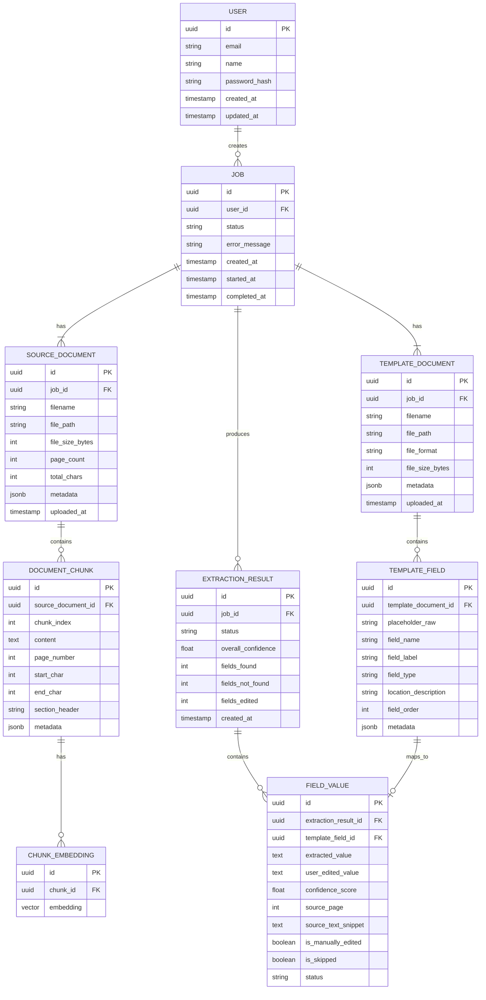

# Data Model

> Defines database schema, document structures, and data formats used across the system.

---

## Entity Relationship Diagram



---

## Table Definitions

### `users`
| Column | Type | Constraints | Description |
|--------|------|-------------|-------------|
| `id` | UUID | PK, default gen_random_uuid() | Unique user ID |
| `email` | VARCHAR(255) | UNIQUE, NOT NULL | User email |
| `name` | VARCHAR(255) | | Display name |
| `password_hash` | VARCHAR(255) | | Bcrypt hash (null if OAuth) |
| `created_at` | TIMESTAMPTZ | NOT NULL, default now() | Account creation time |
| `updated_at` | TIMESTAMPTZ | NOT NULL, default now() | Last update time |

### `jobs`
| Column | Type | Constraints | Description |
|--------|------|-------------|-------------|
| `id` | UUID | PK | Unique job ID |
| `user_id` | UUID | FK → users.id, nullable | Owner (null for anonymous) |
| `status` | VARCHAR(50) | NOT NULL | `queued`, `processing`, `extracting`, `mapping`, `completed`, `failed` |
| `error_message` | TEXT | | Error details if failed |
| `created_at` | TIMESTAMPTZ | NOT NULL | Job creation time |
| `started_at` | TIMESTAMPTZ | | Processing start time |
| `completed_at` | TIMESTAMPTZ | | Processing completion time |

### `source_documents`
| Column | Type | Constraints | Description |
|--------|------|-------------|-------------|
| `id` | UUID | PK | Unique document ID |
| `job_id` | UUID | FK → jobs.id | Parent job |
| `filename` | VARCHAR(255) | NOT NULL | Original filename |
| `file_path` | VARCHAR(500) | NOT NULL | Storage path |
| `file_size_bytes` | INTEGER | | File size |
| `page_count` | INTEGER | | Number of PDF pages |
| `total_chars` | INTEGER | | Total extracted characters |
| `metadata` | JSONB | | Additional metadata (author, title, etc.) |
| `uploaded_at` | TIMESTAMPTZ | NOT NULL | Upload timestamp |

### `document_chunks`
| Column | Type | Constraints | Description |
|--------|------|-------------|-------------|
| `id` | UUID | PK | Unique chunk ID |
| `source_document_id` | UUID | FK → source_documents.id | Parent document |
| `chunk_index` | INTEGER | NOT NULL | Order within document |
| `content` | TEXT | NOT NULL | Chunk text content |
| `page_number` | INTEGER | | Source page number |
| `start_char` | INTEGER | | Start position in full text |
| `end_char` | INTEGER | | End position in full text |
| `section_header` | VARCHAR(500) | | Nearest section header |
| `metadata` | JSONB | | Additional metadata |

### `chunk_embeddings`
| Column | Type | Constraints | Description |
|--------|------|-------------|-------------|
| `id` | UUID | PK | Unique embedding ID |
| `chunk_id` | UUID | FK → document_chunks.id, UNIQUE | Parent chunk |
| `embedding` | VECTOR(768) | NOT NULL | Gemini embedding vector |

**Index**: `CREATE INDEX idx_chunk_embeddings_vector ON chunk_embeddings USING ivfflat (embedding vector_cosine_ops) WITH (lists = 100);`

### `template_documents`
| Column | Type | Constraints | Description |
|--------|------|-------------|-------------|
| `id` | UUID | PK | Unique template ID |
| `job_id` | UUID | FK → jobs.id | Parent job |
| `filename` | VARCHAR(255) | NOT NULL | Original filename |
| `file_path` | VARCHAR(500) | NOT NULL | Storage path |
| `file_format` | VARCHAR(10) | NOT NULL | `docx`, `xlsx`, `pptx` |
| `file_size_bytes` | INTEGER | | File size |
| `metadata` | JSONB | | Additional metadata |
| `uploaded_at` | TIMESTAMPTZ | NOT NULL | Upload timestamp |

### `template_fields`
| Column | Type | Constraints | Description |
|--------|------|-------------|-------------|
| `id` | UUID | PK | Unique field ID |
| `template_document_id` | UUID | FK → template_documents.id | Parent template |
| `placeholder_raw` | VARCHAR(255) | NOT NULL | Original placeholder text (e.g., `{{name}}`) |
| `field_name` | VARCHAR(255) | NOT NULL | Normalized name (e.g., `name`) |
| `field_label` | VARCHAR(255) | | Human-readable label (e.g., "Full Name") |
| `field_type` | VARCHAR(50) | default 'text' | `text`, `date`, `number`, `currency`, `list` |
| `location_description` | TEXT | | Where in template (e.g., "Page 1, paragraph 2") |
| `field_order` | INTEGER | | Order of appearance |
| `metadata` | JSONB | | Additional metadata |

### `extraction_results`
| Column | Type | Constraints | Description |
|--------|------|-------------|-------------|
| `id` | UUID | PK | Unique result ID |
| `job_id` | UUID | FK → jobs.id | Parent job |
| `status` | VARCHAR(50) | NOT NULL | `pending`, `completed`, `reviewed` |
| `overall_confidence` | FLOAT | | Average confidence across fields |
| `fields_found` | INTEGER | | Count of successfully extracted fields |
| `fields_not_found` | INTEGER | | Count of fields with no match |
| `fields_edited` | INTEGER | default 0 | Count of user-edited fields |
| `created_at` | TIMESTAMPTZ | NOT NULL | Extraction timestamp |

### `field_values`
| Column | Type | Constraints | Description |
|--------|------|-------------|-------------|
| `id` | UUID | PK | Unique value ID |
| `extraction_result_id` | UUID | FK → extraction_results.id | Parent result |
| `template_field_id` | UUID | FK → template_fields.id | Mapped template field |
| `extracted_value` | TEXT | | AI-extracted value |
| `user_edited_value` | TEXT | | Value after user edit (null if not edited) |
| `confidence_score` | FLOAT | | 0.0 to 1.0 |
| `source_page` | INTEGER | | Page number in source PDF |
| `source_text_snippet` | TEXT | | Surrounding context from source |
| `is_manually_edited` | BOOLEAN | default false | Whether user edited this value |
| `is_skipped` | BOOLEAN | default false | Whether user chose to skip this field |
| `status` | VARCHAR(50) | default 'extracted' | `extracted`, `not_found`, `edited`, `skipped`, `confirmed` |

---

## Template Placeholder Formats

The system detects the following placeholder patterns:

| Pattern | Example | Regex |
|---------|---------|-------|
| Double curly braces | `{{full_name}}` | `\{\{([^}]+)\}\}` |
| Single curly braces | `{full_name}` | `\{([^}]+)\}` |
| Square brackets | `[full_name]` | `\[([^\]]+)\]` |
| Angle brackets | `<<full_name>>` | `<<([^>]+)>>` |
| Double underscores | `__full_name__` | `__([^_]+)__` |

**Detection priority**: Double curly braces → angle brackets → double underscores → square brackets → single curly braces (to avoid false positives on common bracket usage).

---

## Structured Extraction Output Schema

The Gemini API returns structured JSON for each field extraction:

```json
{
  "field_name": "full_name",
  "extracted_value": "John Doe",
  "confidence": 0.95,
  "source_reference": {
    "page_number": 3,
    "text_snippet": "...the applicant, John Doe, hereby declares...",
    "chunk_id": "abc-123-def"
  },
  "reasoning": "The name 'John Doe' appears as the applicant name on page 3, paragraph 2."
}
```

When the value is not found:

```json
{
  "field_name": "phone_number",
  "extracted_value": null,
  "confidence": 0.0,
  "source_reference": null,
  "reasoning": "No phone number was found in the provided document context."
}
```
