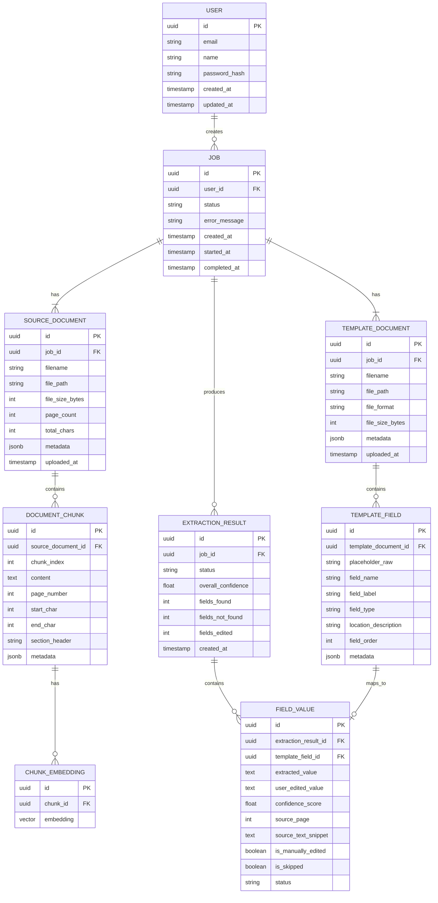

# Data Model

> Defines database schema, document structures, and data formats used across the system.

---

## Entity Relationship Diagram



---

## Table Definitions

### `users`
| Column | Type | Constraints | Description |
|--------|------|-------------|-------------|
| `id` | UUID | PK, default gen_random_uuid() | Unique user ID |
| `email` | VARCHAR(255) | UNIQUE, NOT NULL | User email |
| `name` | VARCHAR(255) | | Display name |
| `password_hash` | VARCHAR(255) | | Bcrypt hash (null if OAuth) |
| `created_at` | TIMESTAMPTZ | NOT NULL, default now() | Account creation time |
| `updated_at` | TIMESTAMPTZ | NOT NULL, default now() | Last update time |

### `jobs` (DB) + In-Memory `Job` (`backend/app/services/jobs/models.py:57`)

| Column | Type | Constraints | Description |
|--------|------|-------------|-------------|
| `id` | UUID | PK | Unique job ID |
| `user_id` | UUID | FK → users.id, nullable | Owner (null for anonymous; MVP anonymous via `free` tier) |
| `status` | VARCHAR(50) | NOT NULL | `queued`→`processing`→`extracting`(80%)→`mapping`→`completed`|`failed`|`generating` (`JobStatus`) |
| `error_message` | TEXT | | Error details if failed (sanitized, not raw `str(e)` per VULN-5) |
| `created_at` | TIMESTAMPTZ | NOT NULL | Job creation time (ISO-8601 `Z`) |
| `started_at` | TIMESTAMPTZ | | Processing start time |
| `completed_at` | TIMESTAMPTZ | | Processing completion time |
| `progress` (in-memory) | JSONB/`JobProgress` | `phase/percent/current_field/total_fields` | `percent 0→100`, `phase: queued/pdf_extraction/embedding/template_mapping/ai_extraction`; ADR-015 fixed `ai_extraction@80%` before batch |
| `engine_used` / `has_fallback` / `fallback_reason` (in-memory) | `VARCHAR/TEXT/BOOLEAN` | | `gemini|hybrid|heuristic` + `fallback_reason` from `extractor.last_fallback_reason` → returned via `to_results_dict()` as `engine_used`/`has_fallback`/`has_ai_error` |
| `overall_confidence` | FLOAT | | `avg(confidence)` over `field_results` |
| `filled_doc_bytes/name` (in-memory) | `BYTEA/VARCHAR` | | Generated docx/xlsx/pptx for `GET /download` (RFC5987 filename) |

### `source_documents`
| Column | Type | Constraints | Description |
|--------|------|-------------|-------------|
| `id` | UUID | PK | Unique document ID |
| `job_id` | UUID | FK → jobs.id | Parent job |
| `filename` | VARCHAR(255) | NOT NULL | Original filename |
| `file_path` | VARCHAR(500) | NOT NULL | Storage path |
| `file_size_bytes` | INTEGER | | File size |
| `page_count` | INTEGER | | Number of PDF pages |
| `total_chars` | INTEGER | | Total extracted characters |
| `metadata` | JSONB | | Additional metadata (author, title, etc.) |
| `uploaded_at` | TIMESTAMPTZ | NOT NULL | Upload timestamp |

### `document_chunks`
| Column | Type | Constraints | Description |
|--------|------|-------------|-------------|
| `id` | UUID | PK | Unique chunk ID |
| `source_document_id` | UUID | FK → source_documents.id | Parent document |
| `chunk_index` | INTEGER | NOT NULL | Order within document |
| `content` | TEXT | NOT NULL | Chunk text content |
| `page_number` | INTEGER | | Source page number |
| `start_char` | INTEGER | | Start position in full text |
| `end_char` | INTEGER | | End position in full text |
| `section_header` | VARCHAR(500) | | Nearest section header |
| `metadata` | JSONB | | Additional metadata |

### `chunk_embeddings`
| Column | Type | Constraints | Description |
|--------|------|-------------|-------------|
| `id` | UUID | PK | Unique embedding ID |
| `chunk_id` | UUID | FK → document_chunks.id, UNIQUE | Parent chunk |
| `embedding` | VECTOR(768) | NOT NULL | Gemini embedding vector |

**Index**: `CREATE INDEX idx_chunk_embeddings_vector ON chunk_embeddings USING ivfflat (embedding vector_cosine_ops) WITH (lists = 100);`

### `template_documents`
| Column | Type | Constraints | Description |
|--------|------|-------------|-------------|
| `id` | UUID | PK | Unique template ID |
| `job_id` | UUID | FK → jobs.id | Parent job |
| `filename` | VARCHAR(255) | NOT NULL | Original filename |
| `file_path` | VARCHAR(500) | NOT NULL | Storage path |
| `file_format` | VARCHAR(10) | NOT NULL | `docx`, `xlsx`, `pptx` |
| `file_size_bytes` | INTEGER | | File size |
| `metadata` | JSONB | | Additional metadata |
| `uploaded_at` | TIMESTAMPTZ | NOT NULL | Upload timestamp |

### `template_fields`
| Column | Type | Constraints | Description |
|--------|------|-------------|-------------|
| `id` | UUID | PK | Unique field ID |
| `template_document_id` | UUID | FK → template_documents.id | Parent template |
| `placeholder_raw` | VARCHAR(255) | NOT NULL | Original placeholder text (e.g., `{{name}}`) |
| `field_name` | VARCHAR(255) | NOT NULL | Normalized name (e.g., `name`) |
| `field_label` | VARCHAR(255) | | Human-readable label (e.g., "Full Name") |
| `field_type` | VARCHAR(50) | default 'text' | `text`, `date`, `number`, `currency`, `list` |
| `location_description` | TEXT | | Where in template (e.g., "Page 1, paragraph 2") |
| `field_order` | INTEGER | | Order of appearance |
| `metadata` | JSONB | | Additional metadata |

### `extraction_results`
| Column | Type | Constraints | Description |
|--------|------|-------------|-------------|
| `id` | UUID | PK | Unique result ID |
| `job_id` | UUID | FK → jobs.id | Parent job |
| `status` | VARCHAR(50) | NOT NULL | `pending`, `completed`, `reviewed` |
| `overall_confidence` | FLOAT | | Average confidence across fields |
| `fields_found` | INTEGER | | Count of successfully extracted fields |
| `fields_not_found` | INTEGER | | Count of fields with no match |
| `fields_edited` | INTEGER | default 0 | Count of user-edited fields |
| `created_at` | TIMESTAMPTZ | NOT NULL | Extraction timestamp |

### `field_values` / In-Memory `FieldResult` (`backend/app/services/jobs/models.py:42` + `generation/extractor.py:36`)

| Column | Type | Constraints | Description |
|--------|------|-------------|-------------|
| `id` / `field_id` | UUID | PK | Unique value/field ID (`FieldResult.field_id`) |
| `extraction_result_id` / `job_id` | UUID | FK → extraction_results.id / `Job.job_id` | Parent result/job (in-memory tied via `Job.field_results`) |
| `template_field_id` / `field_name` | VARCHAR(255) | | Mapped `field_name` (`_normalize_field_name`) + `placeholder` raw (e.g. `{{full_name}}`) + `field_label` Title Case |
| `extracted_value` | TEXT | | AI-extracted value (may have `[AI_ERROR: ...]` prefix if fallback was active) |
| `user_edited_value` | TEXT | | Value after user edit via `PATCH /jobs/{id}/fields/{id}` `action=edit` + `sanitize_text_input(max_len=5000)` |
| `confidence_score` / `confidence` | FLOAT | `0.0..1.0` | `0.85/0.75` for heuristic hits, live `confidence` from Gemini JSON otherwise, `1.0` after manual edit |
| `source_page` / `source_reference.page` | INTEGER | | 1-indexed page mapped from `source_pages[chunk_index]` |
| `source_text_snippet` / `source_reference.snippet` | TEXT (≤200 chars) | | `source_text[:200]` for citation modal; fallback prefix `[AI_ERROR]` if API failed |
| `is_manually_edited` | BOOLEAN | default false | `true` after `edit` |
| `is_skipped` / `status=skipped` | BOOLEAN/VARCHAR | default false | Set by `action=skip`; `PATCH confirm` omits skipped fields from `mapped` |
| `status` | VARCHAR(50) | `extracted|not_found|edited|skipped|confirmed` | `not_found` when `value==null` |
| `extracted_by` (new) | VARCHAR(20) | `gemini|heuristic` (or `hybrid` at job level) | Provenance per field (`extractor.py:45` + `jobs/models.py:53`) → `[Gemini 3.6 Flash]`/`[Fallback]` badges |
| `fallback_reason` (new) | TEXT | | `GEMINI_API_KEY missing` / `model 404 …` / `quota …` / `Field missing…` → `hasFallback` banner |
| `confidence_score` bucketing | — | `≥0.8 high (🟢)`, `0.5–0.8 medium (🟡)`, `<0.5 low/error (🔴)` | Rendered in `ReviewMappingView.tsx` |

---

## Template Placeholder Formats (`backend/app/services/mapping/parser.py:32`)

The system detects the following placeholder patterns (actual `_PLACEHOLDER_PATTERNS` order):

| Pattern | Example | Regex | Location tracking |
|---------|---------|-------|-------------------|
| Double curly braces | `{{full_name}}` | `\{\{\s*([a-zA-Z0-9_\-.\s]+?)\s*\}\}` | `paragraph:{idx}`, `table:{t} row:{r} col:{c}`, `sheet:{name} cell:{coord}`, `slide:{n} shape:{i}` |
| Angle brackets | `<<full_name>>` | `<<\s*([a-zA-Z0-9_\-.\s]+?)\s*>>` | same |
| Square brackets | `[full_name]` | `\[\s*([a-zA-Z0-9_\-.\s]+?)\s*\]` | same |
| Single curly braces | `{full_name}` | `\{\s*([a-zA-Z0-9_\-.\s]+?)\s*\}` | same |
| Double underscores | `__full_name__` | `__\s*([a-zA-Z0-9_\-.\s]+?)\s*__` | same |

**Normalization**: `_normalize_field_name` strips, replaces `[\s.\-]+→_`, collapses `__→_`, `.strip("_")`, `.lower()`. **Dedup**: `used_spans` prevents double-counting nested patterns. Asserts: `inner_strip len≥1`, not numeric-only. **Validation** per `eval/run_eval.py`: `placeholder_detection_rate = len(parsed.fields)/len(fields_gt)` (target ≥0.95).

---

## Structured Extraction Output Schema (`backend/app/services/generation/extractor.py:36` + `jobs/models.py:108`)

### Single-prompt batch (current path — 1 call per document)

Gemini is instructed to return (`_build_batch_prompt`):

```json
{
  "extractions": [
    {
      "field_name": "full_name",
      "value": "John Doe",
      "confidence": 0.95,
      "source_page": 2,
      "source_text": "Full Name: John Doe"
    },
    {
      "field_name": "due_date",
      "value": null,
      "confidence": 0.0,
      "source_page": null,
      "source_text": null
    }
  ]
}
```

Mapped to `ExtractionResult` fields (`field_name/value→extracted_value/confidence/source_page/source_text`) + `extracted_by` (`gemini`|`heuristic` batch-level) and patched with page mapping via `source_pages[chunkIdx]`:

```python
class ExtractionResult(BaseModel):
    field_name: str
    extracted_value: Optional[str] = None
    confidence: float = 0.0  # 0..1
    source_page: Optional[int] = None
    source_text: Optional[str] = None  # ≤500 chars
    status: str  # extracted|not_found|error
    extracted_by: str  # gemini|heuristic|manual
    fallback_reason: Optional[str] = None
```

If JSON parse fails or batch returns `extractions` missing for a field, the missing field is materialized via `FakeExtractor.extract()` (`0.85/0.75` confidence, `distinctive>=0.85` guard).

### Legacy single-field schema (used by `re_extract` hint path)

Prompt `_build_prompt` requests `{"value": "...", "confidence": 0.95, "source_page": 3, "source_text": "snippet"}` parsed by `_parse_json_response`.

### `GET /api/jobs/{id}/results` response (actual `to_results_dict`)

```json
{
  "job_id": "550e...",
  "overall_confidence": 0.87,
  "fields_found": 4,
  "fields_not_found": 1,
  "has_ai_error": true,
  "has_fallback": true,
  "engine_used": "hybrid",
  "fallback_reason": "Field missing in Gemini response, recovered by heuristic",
  "fields": [
    {
      "field_id": "f1a...",
      "field_name": "full_name",
      "field_label": "Full Name",
      "placeholder": "{{full_name}}",
      "extracted_value": "John Doe",
      "confidence": 0.95,
      "source_reference": {"page": 1, "snippet": "Full Name: John Doe"},
      "status": "extracted",
      "is_manually_edited": false,
      "extracted_by": "gemini",
      "fallback_reason": null
    },
    {
      "field_id": "a5b...",
      "field_name": "due_date",
      "extracted_value": null,
      "confidence": 0.0,
      "source_reference": null,
      "status": "not_found",
      "extracted_by": "heuristic",
      "fallback_reason": "Gemini API Error: 429 ..."
    }
  ]
}
```
