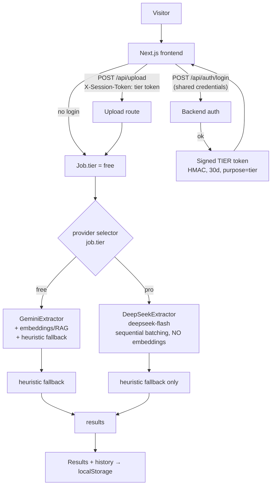

# Tier System Architecture (Free → Gemini, Account → DeepSeek)

> **Status**: PROPOSED — awaiting user approval. Companion to [TIER_PLAN.md](../../1-product/TIER_PLAN.md).
> **Author**: OpenCode (user-directed, 2026-09-26)
> Builds on ADR-018 (PII masking), ADR-019 (per-job session tokens, rate limiting, hardening).

---

## 1. High-Level Flow



**Hard rule**: the `pro` code path must never call a Google endpoint — not for extraction, not for embeddings. Enforced by tests (§8).

---

## 2. Provider Selection (backend)

| Piece | Free (`job.tier = "free"`) | Account (`job.tier = "pro"`) |
|---|---|---|
| Extraction | existing `GeminiExtractor.extract_batch` | **new** `DeepSeekExtractor.extract_batch` |
| RAG embeddings | `gemini-embedding-001` (768d) | **none — retrieval bypassed** (see §3) |
| Fallback on failure | heuristic (existing) | heuristic **only** — never Gemini |
| `engine_used` / `extracted_by` | `gemini` / `hybrid` / `heuristic` | `deepseek` / `heuristic` |
| PII masking (ADR-018) | on | on (defense-in-depth) |

Touchpoints (OpenCode zone):
- `backend/app/services/generation/deepseek_extractor.py` — **new**, same interface as `GeminiExtractor` (`extract`/`extract_batch`), OpenAI-compatible Chat Completions via `httpx`:
  - `POST {DEEPSEEK_BASE_URL}/v1/chat/completions`, `model: deepseek-flash`, `response_format: {"type":"json_object"}`, non-thinking mode, 35 s timeout, 1.2 s pacing, retry w/ backoff on 429/5xx
  - Reuses the shared batch prompt builder, `<document>` untrusted-data fencing, requested-field-only output validation and `_clamp_confidence()` (VULN-07 hardening applies to both providers)
- `backend/app/services/jobs/manager.py` — `process_job` selects extractor + retrieval strategy from `job.tier`; `Job.tier` field added in `models.py`
- `backend/app/services/rag/` — free path unchanged; pro path skips `embedder`/`retriever` entirely (§3)
- `backend/app/core/config.py` — `deepseek_api_key`, `deepseek_model` (default `deepseek-flash`), `deepseek_base_url`, `tier_account_username`, `tier_account_password_hash`, `free_jobs_per_day` (5), `pro_jobs_per_day` (50, tunable)

---

## 3. Why the Account Tier Bypasses RAG (key design decision)

Current RAG calls Gemini **embeddings**, so merely extracting on DeepSeek would still leak document chunks to Google — contradicting the tier's whole privacy promise.

| Option | Verdict |
|---|---|
| **A. Sequential chunk batching, zero embeddings** | ✅ **Chosen.** DeepSeek V4.1-Flash has a **1M-token context**. Small docs (≤15 chunks) already use single-prompt batch today. Large docs are split into *consecutive* (not semantically retrieved) batches of chunks, extracted batch-by-batch, results merged. No Google call, no new dependency, deterministic. |
| B. Local embedding model (e.g. sentence-transformers) | ⏸ Deferred. Privacy-clean but +100 MB dep and CPU load on Render Hobby. Revisit if retrieval quality on very large pro-tier docs is insufficient. |
| C. Keep Gemini embeddings + PII masking | ❌ Rejected — Google still receives the contract's non-masked text; breaks the privacy claim. |

Acceptance signal: quality on the 5-dataset eval for the DeepSeek path must meet `EVAL.md` thresholds (offline fake mode in CI, live run before release).

---

## 4. Authentication (shared credential → signed tier token)

Reuses the HMAC primitives from `backend/app/core/security.py` (ADR-019), with an added **purpose claim** so tier tokens and per-job tokens are mutually invalid:

```json
// tier token payload
{"sub": "tier", "purpose": "tier", "tier": "pro", "exp": <30d>, "nonce": "..."}
// job token payload (unchanged behavior)
{"sub": "<job_id>", "purpose": "job", "exp": <24h>, "nonce": "..."}
```

**Endpoints**

| Method | Path | Behavior |
|---|---|---|
| `POST` | `/api/auth/login` | `{username, password}` → constant-time compare against `TIER_ACCOUNT_USERNAME` + scrypt/argon hash of `TIER_ACCOUNT_PASSWORD_HASH` → 200 `{tier:"pro", token}` + HttpOnly cookie; generic 401 on failure; rate-limited `auth` category **5/min/IP** |
| `POST` | `/api/auth/logout` | Clears cookie (best-effort; token expiry is the real boundary) |
| `GET` | `/api/auth/quota` | `{free_used_today, free_limit, tier}` — powers the UI quota display |

**Credential handling**
- Password stored server-side only as a salted hash (`hashlib.scrypt`, stdlib — no new dependency). A helper script `scripts/hash_password.py` generates it.
- Env vars: `TIER_ACCOUNT_USERNAME`, `TIER_ACCOUNT_PASSWORD_HASH` — added to `.env.example` + `render.yaml` (Both-owned files → note in CONTEXT.md before editing).
- Rotation = change env var + redeploy; old tokens keep working until expiry, so include a `password_version` claim if instant revocation is ever needed (noted as future hardening, not v1).

**Tier → job binding**
- `POST /api/upload` accepts an optional `X-Session-Token` (tier token). If valid → `Job.tier = "pro"`, else `"free"`. Response includes `"tier"` so the UI can confirm.
- All `/jobs/*` authorization (VULN-01) is unchanged; tier only changes *how* the job is processed.

**Frontend**
- New `AuthModal`/`LoginModal` component (does not exist yet — TASK 3.8's claimed AuthModal is not in the repo): username/password form → `api.login()` → token stored as HttpOnly cookie + `localStorage['tf_tier_token']` fallback; tier state in Navbar (badge: `Free · Gemini` / `Account · DeepSeek`).
- On 401/quota-429 the UI shows the request-an-account path with `hanif.isya.annafi-2024@fst.unair.ac.id`.

---

## 5. Quotas & Rate Limits

New categories on the existing `InMemoryRateLimiter` (a `day` window is added; pruning/`MAX_TRACKED_KEYS` from VULN-05 applies):

| Category | Limit | Key | Applies to |
|---|---|---|---|
| `upload` (existing) | 10/h | IP | all uploads |
| `free_upload` (**new**) | **5/day** | IP | uploads with `tier=free` |
| `pro_upload` (**new**) | 50/day (tunable) | IP | uploads with `tier=pro` — bounds DeepSeek spend |
| `auth` (**new**) | 5/min | IP | login attempts |

429 responses carry `Retry-After` and `error.code = "QUOTA_EXCEEDED"`; the frontend maps that to the account-request screen. Because *everyone shares one password*, the per-IP caps are the main cost/abuse control — they stay enforced even for logged-in users.

---

## 6. Data & Privacy Model

| Data | Free tier | Account tier |
|---|---|---|
| Document text to Google (extraction) | ✅ yes (Gemini free) | ❌ never |
| Document chunks to Google (embeddings) | ✅ yes | ❌ never (§3) |
| Masked identifiers to any LLM | ❌ masked before send (ADR-018) | ❌ masked before send |
| Document persisted server-side | ❌ RAM only, ≤24 h TTL | same |
| History/results storage | `localStorage` only | same |

**localStorage schema (frontend, Antigravity)** — stores results/metadata, never raw uploaded file bytes (they can't be re-read after upload):

```
tf_history: [ { sessionId, createdAt, tier, engineUsed,
                sourceDoc:{filename,size}, templateDoc:{filename,format},
                overallConfidence, fieldCount, filledFilename, downloadExpired: true } ]
tf_tier_token: "<signed token>"        // fallback when cookies are blocked
```

Server-side `GET /jobs/{id}/download` expires with the job (≤24 h); history entries therefore show *metadata + re-upload CTA* rather than a dead download link — unless we later choose to keep filled bytes as a `Blob` in IndexedDB (optional enhancement, not v1).

---

## 7. API Contract Additions

| Method | Path | Auth | Notes |
|---|---|---|---|
| `POST` | `/api/auth/login` | — | rate-limited, generic 401 |
| `POST` | `/api/auth/logout` | tier token | cookie clear |
| `GET` | `/api/auth/quota` | optional tier token | `{free_used_today, free_limit, tier}` |
| `POST` | `/api/upload` | optional tier token | + `"tier"` in response; 429 `QUOTA_EXCEEDED` |
| `GET` | `/api/jobs/{id}` | job token (unchanged) | adds `"tier"` |

`docs/2-architecture/API.md` gets a new "Tiers & Auth" section (task 6.14). Frontend `types.ts` unions gain `deepseek`:
`FieldMapping.extractedBy` and `ExtractionResult.engineUsed` add `'deepseek'`; `UserAccount.tier` reuses `'free' | 'pro'` (existing stubs in `types.ts`/`api.ts` are mock-only today).

---

## 8. Test & Eval Strategy (details in TESTING.md / FEEDBACK_LOOP.md)

| Layer | New coverage | Owner |
|---|---|---|
| Unit (backend) | password hash/verify, token purpose isolation (tier↔job), provider selection per tier, quota counter, DeepSeek request building, sequential batching merge | OpenCode |
| Integration | login→upload→results on pro path with Gemini **mocked to raise** (proves zero Google calls); free path capped at 5 with 429 + `Retry-After`; DeepSeek failure→heuristic (never Gemini) | OpenCode |
| Frontend | login modal flow, badge states, quota banner, localStorage history write/read, engine badge `deepseek` | Antigravity |
| E2E | both tiers full flow (existing `e2e.test.mjs` extended) | Antigravity |
| Eval | `run_eval.py --provider deepseek` (fake offline in CI, live pre-release) meeting EVAL.md thresholds | OpenCode |

Offline rule stands: CI has **no** real API keys; DeepSeek has a `force_fake` path mirroring `FakeExtractor`.

---

## 9. Risks & Mitigations

| Risk | Impact | Mitigation |
|---|---|---|
| One shared password leaked publicly | strangers burn DeepSeek budget | password handed out privately only; per-IP daily caps; `DEEPSEEK` key server-side only; monthly cost check task |
| DeepSeek privacy claim wrong | false advertising | task 6.15 verifies terms **before** UI copy ships; wording stays factual |
| Sequential batching quality < RAG on huge docs | accuracy drop on pro tier | eval gate per provider; option B (local embeddings) as backup plan |
| Gemini/DeepSeek model rename (past incidents ADR-011/017) | 404 storms | model id is config-only (`DEEPSEEK_MODEL`), same sanitization/blacklist pattern as Gemini |
| Rate limiter day-window state in RAM | resets on deploy/restart | acceptable (conservative reset); documented |
| Users confuse "localStorage" with "no upload" | mistrust | disclosure copy says processing still happens on the server, RAM-only, ≤24 h |

---

## 10. Rollback

Provider selection is config-driven: unset `DEEPSEEK_API_KEY` / `TIER_ACCOUNT_PASSWORD_HASH` → login endpoint returns 503-configured-off and every job runs free-tier as today. No schema migrations exist (jobs are in-memory), so rollback = env change + redeploy.
