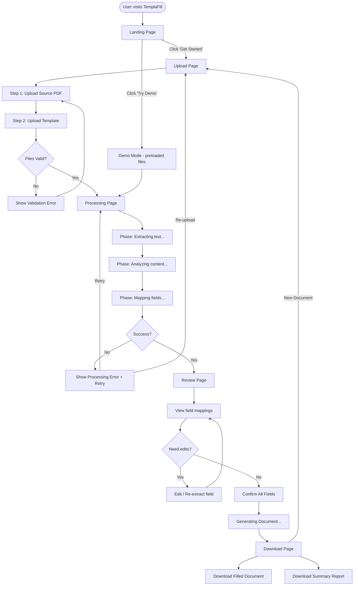

# UX Design

> Describes the user flow, page layouts, and interaction patterns for TemplaFill.

---

## User Flow



---

## Page Descriptions

### 1. Landing Page

**Purpose**: Explain what TemplaFill does, show value, drive uploads.

**Layout**:
```
┌─────────────────────────────────────────────────┐
│  [Logo] TemplaFill              [Try Demo] [→]  │
├─────────────────────────────────────────────────┤
│                                                  │
│       Extract. Map. Fill.                        │
│       AI-powered document automation             │
│                                                  │
│  Upload a source PDF and a template.             │
│  TemplaFill extracts the right data and          │
│  fills your template automatically.              │
│                                                  │
│        [ Get Started → ]                         │
│                                                  │
├─────────────────────────────────────────────────┤
│  How it Works                                    │
│                                                  │
│  ┌──────┐   ┌──────┐   ┌──────┐                │
│  │  📄  │ → │  🔍  │ → │  ✅  │                │
│  │Upload│   │Review│   │ Done │                │
│  └──────┘   └──────┘   └──────┘                │
│                                                  │
│  1. Upload source     2. Review         3. Download    │
│     PDF + template       AI mappings       filled doc  │
│                                                  │
├─────────────────────────────────────────────────┤
│  Works With                                      │
│  [.docx] [.xlsx] [.pptx]                        │
│                                                  │
├─────────────────────────────────────────────────┤
│  Use Cases                                       │
│  Legal • HR • Finance • Education • Government   │
│                                                  │
├─────────────────────────────────────────────────┤
│  Footer: Privacy • GitHub • Contact              │
└─────────────────────────────────────────────────┘
```

---

### 2. Upload Page

**Purpose**: Guided two-step file upload.

**Layout**:
```
┌─────────────────────────────────────────────────┐
│  [←] TemplaFill                                  │
├─────────────────────────────────────────────────┤
│                                                  │
│  Step 1 of 2: Upload Source Document             │
│  ○━━━━━━━━━━━━━●━━━━━━━━━━━━━○                 │
│  Source         Template      Process            │
│                                                  │
│  ┌─────────────────────────────────────┐        │
│  │                                     │        │
│  │     📄 Drag & drop your PDF here    │        │
│  │        or click to browse           │        │
│  │                                     │        │
│  │     Supported: PDF (max 50MB)       │        │
│  └─────────────────────────────────────┘        │
│                                                  │
│  After upload:                                   │
│  ┌─────────────────────────────────────┐        │
│  │ ✅ court_filing.pdf                  │        │
│  │    150 pages • 2.1 MB • 45,000 chars│        │
│  │    [Remove] [Preview]               │        │
│  └─────────────────────────────────────┘        │
│                                                  │
│                          [ Next: Upload Template → ]│
└─────────────────────────────────────────────────┘
```

**Step 2** shows the same layout but for template upload with format selector (.docx / .xlsx / .pptx). After upload, detected fields are listed.

---

### 3. Processing Page

**Purpose**: Show progress while the AI processes documents.

**Layout**:
```
┌─────────────────────────────────────────────────┐
│  [←] TemplaFill                                  │
├─────────────────────────────────────────────────┤
│                                                  │
│                   ⚙️ Processing...                │
│                                                  │
│  ┌─────────────────────────────────────┐        │
│  │ ✅ Extracting text from PDF          │        │
│  │ ✅ Analyzing document structure      │        │
│  │ ⏳ Extracting field values (8/15)    │ ███░░ │
│  │ ○ Mapping to template               │        │
│  └─────────────────────────────────────┘        │
│                                                  │
│  Estimated time remaining: ~20 seconds           │
│                                                  │
│  ┌─────────────────────────────────────┐        │
│  │ 💡 Tip: TemplaFill uses RAG to      │        │
│  │ retrieve only the relevant parts     │        │
│  │ of your document for each field,     │        │
│  │ ensuring accurate extraction.        │        │
│  └─────────────────────────────────────┘        │
│                                                  │
└─────────────────────────────────────────────────┘
```

---

### 4. Review Page (Core Page)

**Purpose**: Show extracted data mapped to template fields. This is the most important page.

**Layout**:
```
┌─────────────────────────────────────────────────────────────┐
│  [←] TemplaFill                    [Confirm All & Generate] │
├─────────────────────────────────────────────────────────────┤
│                                                              │
│  Review Extracted Data     Confidence: 87% (12/15 found)     │
│                                                              │
│  ┌───────────────────────┬──────────────────────────────┐   │
│  │    Template Fields     │     Source Reference          │   │
│  ├───────────────────────┼──────────────────────────────┤   │
│  │                       │                               │   │
│  │ Full Name        🟢   │ Page 3:                       │   │
│  │ ┌───────────────────┐ │ "...the applicant,            │   │
│  │ │ John Doe      [✏️] │ │  **John Doe**, hereby        │   │
│  │ └───────────────────┘ │  declares..."                 │   │
│  │   [🔄 Re-extract]     │                               │   │
│  │                       │                               │   │
│  ├───────────────────────┼──────────────────────────────┤   │
│  │                       │                               │   │
│  │ Case Number      🟢   │ Page 1:                       │   │
│  │ ┌───────────────────┐ │ "Case No. **2026/PDT/1234**  │   │
│  │ │ 2026/PDT/1234 [✏️]│ │  District Court of..."       │   │
│  │ └───────────────────┘ │                               │   │
│  │                       │                               │   │
│  ├───────────────────────┼──────────────────────────────┤   │
│  │                       │                               │   │
│  │ Phone Number     🔴   │                               │   │
│  │ ┌───────────────────┐ │ ⚠️ Not found in source        │   │
│  │ │ (not found)   [✏️]│ │ document. You can enter       │   │
│  │ └───────────────────┘ │ manually or skip this field.  │   │
│  │   [🔄 Re-extract]     │                               │   │
│  │   [⏭️ Skip field]     │                               │   │
│  │                       │                               │   │
│  └───────────────────────┴──────────────────────────────┘   │
│                                                              │
│  Summary: 12 found • 3 not found • 0 edited                 │
│                                                              │
│                            [ ← Back ] [ Confirm & Generate →]│
└─────────────────────────────────────────────────────────────┘
```

**Key interactions**:
- **Green dot** 🟢 = high confidence (≥ 0.8)
- **Yellow dot** 🟡 = medium confidence (0.5 - 0.8)
- **Red dot** 🔴 = not found or low confidence (< 0.5)
- **Edit button** ✏️ = inline edit the value
- **Re-extract** 🔄 = ask AI to try again (with optional hint)
- **Skip** ⏭️ = leave this field blank in output

---

### 5. Download Page

**Purpose**: Download the filled document and summary.

**Layout**:
```
┌─────────────────────────────────────────────────┐
│  [←] TemplaFill                                  │
├─────────────────────────────────────────────────┤
│                                                  │
│              ✅ Document Ready!                   │
│                                                  │
│  ┌─────────────────────────────────────┐        │
│  │ 📄 case_summary_Filled_2026-09-23   │        │
│  │    .docx • 48 KB • 15 fields filled │        │
│  │                                     │        │
│  │    [ ⬇️ Download Filled Document ]   │        │
│  └─────────────────────────────────────┘        │
│                                                  │
│  ┌─────────────────────────────────────┐        │
│  │ 📊 Extraction Summary Report        │        │
│  │    PDF • All field sources listed   │        │
│  │                                     │        │
│  │    [ ⬇️ Download Summary ]           │        │
│  └─────────────────────────────────────┘        │
│                                                  │
│  ┌─────────────────────────────────────┐        │
│  │ 🔁 Process Another Document         │        │
│  │    [ Start New → ]                  │        │
│  └─────────────────────────────────────┘        │
│                                                  │
│  ⏰ Files will be automatically deleted          │
│     in 24 hours for your privacy.                │
│                                                  │
└─────────────────────────────────────────────────┘
```

---

## Responsive Design Breakpoints

| Breakpoint | Width | Layout Adaptation |
|-----------|-------|-------------------|
| Mobile | < 640px | Single column, stacked upload areas, simplified review |
| Tablet | 640-1024px | Two-column review (narrower), side-by-side upload |
| Desktop | > 1024px | Full two-column review with source panel |

---

## Key Interaction Patterns

### Drag & Drop Upload
- Visual drop zone with dashed border
- Drop zone highlights on drag over (color change + scale)
- File type validation on drop (immediate feedback)
- Animated transition from empty state to file preview

### Progress Animation
- Smooth progress bar with gradient
- Animated phase icons (check mark slides in when phase completes)
- Pulsing "current phase" indicator
- Estimated time countdown

### Field Review
- Smooth scroll between fields
- Inline edit with auto-save (debounced)
- Confidence badge with tooltip explaining score
- Source reference panel slides in on click
- Keyboard navigation: Tab between fields, Enter to confirm

### Toast Notifications
- Success: green, auto-dismiss 3s
- Warning: yellow, manual dismiss
- Error: red, manual dismiss with action button
