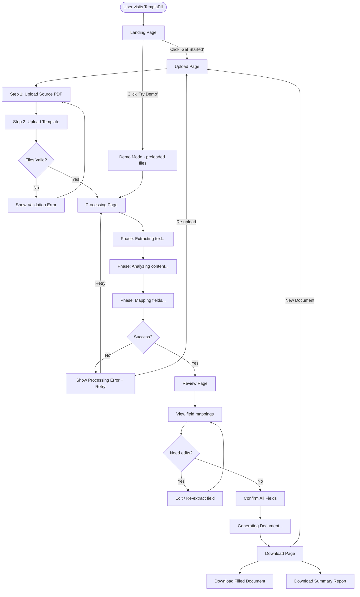

# UX Design

> Describes the user flow, page layouts, and interaction patterns for TemplaFill.
> **Last updated**: 2026-09-26 (frontend polish pass — modal primitive, tier-aware
> copy, a11y). Reflects the shipped implementation in `frontend/src`.

---

## Theme

TemplaFill ships **dark-only** (the `dark` class is applied on `<html>` in
`frontend/src/app/layout.tsx`). There is intentionally no light mode or theme
toggle; the design targets a high-contrast technical/industrial dark surface.
Light-mode utility classes retained in some components are inert and should not
be relied upon.

---

## User Flow


```mermaid
flowchart TD
    START([User visits TemplaFill]) --> LANDING[Landing Page]

    LANDING -->|"Click 'Get Started'"| UPLOAD[Upload Page]
    LANDING -->|"Click 'Try Demo'"| DEMO[Demo Mode - preloaded files]

    UPLOAD --> UPLOAD_SOURCE["Step 1: Upload Source PDF"]
    UPLOAD_SOURCE --> UPLOAD_TEMPLATE["Step 2: Upload Template"]
    UPLOAD_TEMPLATE --> VALIDATE{Files Valid?}

    VALIDATE -->|No| ERROR_UPLOAD[Show Validation Error]
    ERROR_UPLOAD --> UPLOAD_SOURCE

    VALIDATE -->|Yes| PROCESSING[Processing Page]

    PROCESSING --> PROCESS_EXTRACT["Phase: Extracting text..."]
    PROCESS_EXTRACT --> PROCESS_EMBED["Phase: Analyzing content..."]
    PROCESS_EMBED --> PROCESS_MAP["Phase: Mapping fields..."]
    PROCESS_MAP --> PROCESS_DONE{Success?}

    PROCESS_DONE -->|No| ERROR_PROCESS[Show Processing Error + Retry]
    ERROR_PROCESS -->|Retry| PROCESSING
    ERROR_PROCESS -->|Re-upload| UPLOAD

    PROCESS_DONE -->|Yes| REVIEW[Review Page]

    REVIEW --> REVIEW_FIELDS["View field mappings"]
    REVIEW_FIELDS --> EDIT{"Need edits?"}

    EDIT -->|Yes| EDIT_FIELD[Edit / Re-extract field]
    EDIT_FIELD --> REVIEW_FIELDS

    EDIT -->|No| CONFIRM[Confirm All Fields]
    CONFIRM --> GENERATE[Generating Document...]
    GENERATE --> DOWNLOAD[Download Page]

    DOWNLOAD --> DL_FILLED["Download Filled Document"]
    DOWNLOAD --> DL_SUMMARY["Download Summary Report"]
    DOWNLOAD -->|"New Document"| UPLOAD

    DEMO --> PROCESSING
```

---

## Page Descriptions

### 1. Landing Page

**Purpose**: Explain what TemplaFill does, show value, drive uploads.

**Layout**:
```
┌─────────────────────────────────────────────────┐
│  [Logo] TemplaFill              [Try Demo] [→]  │
├─────────────────────────────────────────────────┤
│                                                  │
│       Extract. Map. Fill.                        │
│       AI-powered document automation             │
│                                                  │
│  Upload a source PDF and a template.             │
│  TemplaFill extracts the right data and          │
│  fills your template automatically.              │
│                                                  │
│        [ Get Started → ]                         │
│                                                  │
├─────────────────────────────────────────────────┤
│  How it Works                                    │
│                                                  │
│  ┌──────┐   ┌──────┐   ┌──────┐                │
│  │  📄  │ → │  🔍  │ → │  ✅  │                │
│  │Upload│   │Review│   │ Done │                │
│  └──────┘   └──────┘   └──────┘                │
│                                                  │
│  1. Upload source     2. Review         3. Download    │
│     PDF + template       AI mappings       filled doc  │
│                                                  │
├─────────────────────────────────────────────────┤
│  Works With                                      │
│  [.docx] [.xlsx] [.pptx]                        │
│                                                  │
├─────────────────────────────────────────────────┤
│  Use Cases                                       │
│  Legal • HR • Finance • Education • Government   │
│                                                  │
├─────────────────────────────────────────────────┤
│  Footer: Privacy • GitHub • Contact              │
└─────────────────────────────────────────────────┘
```

---

### 2. Upload Page

**Purpose**: Guided two-step file upload.

**Layout**:
```
┌─────────────────────────────────────────────────┐
│  [←] TemplaFill                                  │
├─────────────────────────────────────────────────┤
│                                                  │
│  Step 1 of 2: Upload Source Document             │
│  ○━━━━━━━━━━━━━●━━━━━━━━━━━━━○                 │
│  Source         Template      Process            │
│                                                  │
│  ┌─────────────────────────────────────┐        │
│  │                                     │        │
│  │     📄 Drag & drop your PDF here    │        │
│  │        or click to browse           │        │
│  │                                     │        │
│  │     Supported: PDF (max 50MB)       │        │
│  └─────────────────────────────────────┘        │
│                                                  │
│  After upload:                                   │
│  ┌─────────────────────────────────────┐        │
│  │ ✅ court_filing.pdf                  │        │
│  │    150 pages • 2.1 MB • 45,000 chars│        │
│  │    [Remove] [Preview]               │        │
│  └─────────────────────────────────────┘        │
│                                                  │
│                          [ Next: Upload Template → ]│
└─────────────────────────────────────────────────┘
```

**Step 2** shows the same layout but for template upload with format selector (.docx / .xlsx / .pptx). After upload, detected fields are listed.

---

### 3. Processing Page

**Purpose**: Show progress while the AI processes documents.

**Layout**:
```
┌─────────────────────────────────────────────────┐
│  [←] TemplaFill                                  │
├─────────────────────────────────────────────────┤
│                                                  │
│                   ⚙️ Processing...                │
│                                                  │
│  ┌─────────────────────────────────────┐        │
│  │ ✅ Extracting text from PDF          │        │
│  │ ✅ Analyzing document structure      │        │
│  │ ⏳ Extracting field values (8/15)    │ ███░░ │
│  │ ○ Mapping to template               │        │
│  └─────────────────────────────────────┘        │
│                                                  │
│  Estimated time remaining: ~20 seconds           │
│                                                  │
│  ┌─────────────────────────────────────┐        │
│  │ 💡 Tip: TemplaFill uses RAG to      │        │
│  │ retrieve only the relevant parts     │        │
│  │ of your document for each field,     │        │
│  │ ensuring accurate extraction.        │        │
│  └─────────────────────────────────────┘        │
│                                                  │
└─────────────────────────────────────────────────┘
```

---

### 4. Review Page (Core Page)

**Purpose**: Show extracted data mapped to template fields. This is the most important page.

**Layout**:
```
┌─────────────────────────────────────────────────────────────┐
│  [←] TemplaFill                    [Confirm All & Generate] │
├─────────────────────────────────────────────────────────────┤
│                                                              │
│  Review Extracted Data     Confidence: 87% (12/15 found)     │
│                                                              │
│  ┌───────────────────────┬──────────────────────────────┐   │
│  │    Template Fields     │     Source Reference          │   │
│  ├───────────────────────┼──────────────────────────────┤   │
│  │                       │                               │   │
│  │ Full Name        🟢   │ Page 3:                       │   │
│  │ ┌───────────────────┐ │ "...the applicant,            │   │
│  │ │ John Doe      [✏️] │ │  **John Doe**, hereby        │   │
│  │ └───────────────────┘ │  declares..."                 │   │
│  │   [🔄 Re-extract]     │                               │   │
│  │                       │                               │   │
│  ├───────────────────────┼──────────────────────────────┤   │
│  │                       │                               │   │
│  │ Case Number      🟢   │ Page 1:                       │   │
│  │ ┌───────────────────┐ │ "Case No. **2026/PDT/1234**  │   │
│  │ │ 2026/PDT/1234 [✏️]│ │  District Court of..."       │   │
│  │ └───────────────────┘ │                               │   │
│  │                       │                               │   │
│  ├───────────────────────┼──────────────────────────────┤   │
│  │                       │                               │   │
│  │ Phone Number     🔴   │                               │   │
│  │ ┌───────────────────┐ │ ⚠️ Not found in source        │   │
│  │ │ (not found)   [✏️]│ │ document. You can enter       │   │
│  │ └───────────────────┘ │ manually or skip this field.  │   │
│  │   [🔄 Re-extract]     │                               │   │
│  │   [⏭️ Skip field]     │                               │   │
│  │                       │                               │   │
│  └───────────────────────┴──────────────────────────────┘   │
│                                                              │
│  Summary: 12 found • 3 not found • 0 edited                 │
│                                                              │
│                            [ ← Back ] [ Confirm & Generate →]│
└─────────────────────────────────────────────────────────────┘
```

**Key interactions**:
- **Green dot** 🟢 = high confidence (≥ 0.8)
- **Yellow dot** 🟡 = medium confidence (0.5 - 0.8)
- **Red dot** 🔴 = not found or low confidence (< 0.5)
- **Edit button** ✏️ = inline edit the value
- **Re-extract** 🔄 = ask AI to try again (with optional hint; the modal names the active engine)
- **Skip** ⏭️ = leave this field blank in output
- **Generate** is disabled while every non-skipped field is empty, with inline guidance
- Engine badges are tier-aware: `Gemini 3.6 Flash` (free) / `DeepSeek` (account) / `Fallback`

> **Tier context**: the Navbar shows a persistent tier badge — `Free · Gemini`
> (full) or `Free` (compact, mobile) / `Account · DeepSeek`. On the free tier the
> landing and upload screens also show the Google-training + 5-jobs/day disclosure
> and a quota countdown; hitting the cap routes to the request-an-account screen.

---

### 5. Download Page

**Purpose**: Download the filled document and summary.

**Layout**:
```
┌─────────────────────────────────────────────────┐
│  [←] TemplaFill                                  │
├─────────────────────────────────────────────────┤
│                                                  │
│              ✅ Document Ready!                   │
│                                                  │
│  ┌─────────────────────────────────────┐        │
│  │ 📄 case_summary_Filled_2026-09-23   │        │
│  │    .docx • 48 KB • 15 fields filled │        │
│  │                                     │        │
│  │    [ ⬇️ Download Filled Document ]   │        │
│  └─────────────────────────────────────┘        │
│                                                  │
│  ┌─────────────────────────────────────┐        │
│  │ 📊 Extraction Summary Report        │        │
│  │    PDF • All field sources listed   │        │
│  │                                     │        │
│  │    [ ⬇️ Download Summary ]           │        │
│  └─────────────────────────────────────┘        │
│                                                  │
│  ┌─────────────────────────────────────┐        │
│  │ 🔁 Process Another Document         │        │
│  │    [ Start New → ]                  │        │
│  └─────────────────────────────────────┘        │
│                                                  │
│  ⏰ Files will be automatically deleted          │
│     in 24 hours for your privacy.                │
│                                                  │
└─────────────────────────────────────────────────┘
```

---

## Responsive Design Breakpoints

| Breakpoint | Width | Layout Adaptation |
|-----------|-------|-------------------|
| Mobile | < 640px | Single column, stacked upload areas, simplified review |
| Tablet | 640-1024px | Two-column review (narrower), side-by-side upload |
| Desktop | > 1024px | Full two-column review with source panel |

---

## Key Interaction Patterns

### Drag & Drop Upload
- Visual drop zone with dashed border
- Drop zone highlights on drag over (border + background color change)
- File type validation on drop (immediate feedback)
- Invalid files surface an in-app toast (`onValidationError`), not a native `alert()`
- Animated transition from empty state to file preview

### Progress Animation
- Solid progress bar (no gradient) with a smooth width transition
- Phase rows: completed (`CheckCircle2`), active (spinner), pending (numbered)
- Stage labels and the execution-log engine name are **tier-aware**
  (`Free → Google Gemini 3.6 Flash`, `Account → DeepSeek`)
- Respects `prefers-reduced-motion` (animations collapse to near-zero)

### Field Review
- Inline edit with explicit save/cancel
- Confidence badge with color + percentage
- Source reference opens the shared `CitationModal`
- Empty-value guard: **Generate is disabled** until at least one non-skipped field
  has a value
- View state resets per session via `key={sessionId}` on `ReviewMappingView`

### Modals
All dialogs use the shared `Modal` primitive (`frontend/src/components/Modal.tsx`):
- Rendered through a portal, `role="dialog"` + `aria-modal="true"` + `aria-labelledby`
- **Escape** closes; clicking the backdrop closes
- Focus moves into the dialog on open and **returns to the trigger** on close
- Focus is trapped within the dialog while open; body scroll is locked

### Toast Notifications
- Success / info auto-dismiss (~4.2s); **warning / error persist** until dismissed
- `role="alert"` + `aria-live="assertive"` for errors, `status`/`polite` otherwise
- Rendered in a labelled `role="region"` so assistive tech announces them

### Accessibility
- Keyboard-visible focus rings via the `.focus-ring` utility (`:focus-visible`)
- Icon-only controls carry `aria-label`; the mobile workflow indicator exposes
  `aria-label="Step N of 4: …"`
- Reduced-motion users get near-instant transitions (`prefers-reduced-motion`)

---
