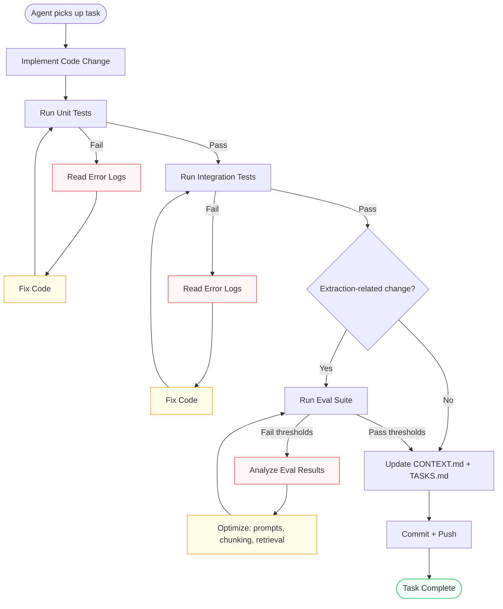

# Closed-Loop Feedback Process

> Defines the iterative development loop that ensures quality through automated testing, evaluation, and revision cycles.

---

## Overview

The Closed-Loop Feedback (CLF) process ensures that every code change is validated against quality criteria before being accepted. It replaces the traditional "write code → commit → hope it works" with a disciplined cycle of **implement → test → evaluate → diagnose → fix → repeat**.



---

## The Loop in Practice

### Step 1: Implement
- Agent picks up a task from `TASKS.md`
- Writes code following conventions in `AGENTS.md`
- Updates relevant documentation if architecture changes

### Step 2: Test (Unit)
```bash
# Backend
cd backend && pytest tests/unit/ -v

# Frontend
cd frontend && npm test -- --watchAll=false
```
- **Exit criteria**: All unit tests pass
- **Max retry cycles**: 5 (if still failing after 5 fix attempts, escalate to user)

### Step 3: Test (Integration)
```bash
# Backend integration
cd backend && pytest tests/integration/ -v

# Full pipeline test
cd backend && pytest tests/test_pipeline.py -v
```
- **Exit criteria**: All integration tests pass
- **Max retry cycles**: 3

### Step 4: Evaluate (Extraction changes only)
```bash
cd eval && python run_eval.py --dataset datasets/ --output results/
```
- **Exit criteria**: All metrics meet thresholds defined in `EVAL.md`
- **Max retry cycles**: 5 (each cycle involves optimizing prompts, chunking, or retrieval)

### Step 5: Diagnose & Fix
When a test or eval fails, the agent MUST:

1. **Read the error** — full stack trace, assertion message, or eval report
2. **Identify root cause** — is it a code bug, a prompt issue, a data issue, or a design flaw?
3. **Fix the smallest thing** — don't refactor everything; fix the specific failing case
4. **Re-run** — only the failing tests, not the full suite (unless the fix was broad)
5. **Log the diagnosis** — what failed, why, and how it was fixed (in commit message or `DECISIONS.md` if significant)

### Step 6: Update & Commit
After all tests/evals pass:
1. Update `TASKS.md` — mark task as `done`
2. Update `CONTEXT.md` — summarize what was done
3. Commit with descriptive message
4. Push to feature branch

---

## Feedback Sources

| Source | What It Tells Us | When to Check |
|--------|-----------------|---------------|
| **Unit tests** | Individual function correctness | Every code change |
| **Integration tests** | System component interaction | Every feature completion |
| **Eval suite** | Extraction accuracy vs. ground truth | Extraction/RAG changes |
| **User corrections** | Where AI gets it wrong in real usage | Post-launch (Phase 2+) |
| **Error logs** | Runtime failures, API errors | During testing & production |
| **Gemini API response** | Model quality, response format | Extraction changes |

---

## Escalation Policy

| Situation | Action |
|-----------|--------|
| Test fails after 5 fix attempts | Agent stops, logs issue in `CONTEXT.md`, asks user for help |
| Eval metrics are close but don't meet threshold | Agent documents the gap, proposes solutions, asks user to accept or iterate |
| Test passes but behavior seems wrong | Agent adds more test cases to cover the suspicious behavior |
| Conflicting requirements discovered | Agent logs in `DECISIONS.md` with status `PENDING`, asks user |

---

## Anti-Patterns to Avoid

| ❌ Don't | ✅ Do |
|----------|------|
| Skip tests to save time | Run all relevant tests before commit |
| Disable failing tests | Fix the root cause or document why it's deferred |
| Ignore eval metrics | Treat them as hard gates |
| Make changes without re-running tests | Always re-run after every fix |
| Fix symptoms instead of causes | Diagnose root cause before patching |
| Refactor unrelated code during a fix cycle | Stay focused on the failing test |
