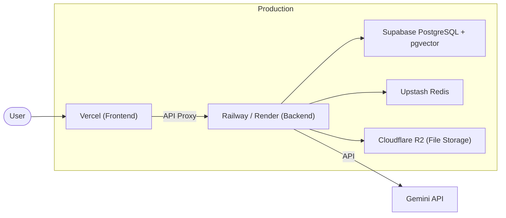

# Deployment

> How to deploy TemplaFill to production and staging environments.

---

## Architecture Overview



---

## Hosting Choices

### Free-Tier Friendly (MVP)

| Component | Provider | Free Tier Limit |
|-----------|----------|----------------|
| Frontend | **Vercel** | 100GB bandwidth/month, auto-deploy from Git |
| Backend | **Render** | 750 hours/month (sleeps after 15min idle) |
| Database | **Supabase** | 500MB, pgvector included |
| Redis | **Upstash** | 10,000 commands/day |
| File Storage | **Cloudflare R2** | 10GB storage, 10M reads/month |
| Domain | **Cloudflare** | Free DNS, SSL |

### Scaling Up (Post-MVP)

| Component | Provider | Pricing |
|-----------|----------|---------|
| Frontend | Vercel Pro | $20/month |
| Backend | Railway | $5/month base + usage |
| Database | Supabase Pro | $25/month |
| Redis | Upstash Pro | $10/month |
| File Storage | R2 | $0.015/GB/month |

---

## Deployment Steps

### Frontend (Vercel)

```bash
# 1. Connect repo to Vercel
#    Go to vercel.com → New Project → Import Git Repository

# 2. Set environment variables in Vercel dashboard:
#    NEXT_PUBLIC_API_URL=https://api.templafill.com/api

# 3. Configure build settings:
#    Root Directory: frontend
#    Build Command: npm run build
#    Output Directory: .next

# 4. Deploy
#    Automatic on push to `main` branch
```

### Backend (Render)

```bash
# 1. Create Web Service on render.com
#    Connect Git repository

# 2. Build settings:
#    Root Directory: backend
#    Build Command: pip install -r requirements.txt
#    Start Command: uvicorn app.main:app --host 0.0.0.0 --port $PORT

# 3. Set environment variables:
#    DATABASE_URL, REDIS_URL, GEMINI_API_KEY, SECRET_KEY, etc.

# 4. Add Celery worker:
#    Create separate Background Worker service
#    Start Command: celery -A app.worker worker --loglevel=info
```

### Database (Supabase)

```bash
# 1. Create project on supabase.com
# 2. Enable pgvector extension:
#    SQL Editor → run: CREATE EXTENSION IF NOT EXISTS vector;
# 3. Run migrations:
#    alembic upgrade head
# 4. Copy connection string to backend env vars
```

---

## CI/CD Pipeline

### GitHub Actions

```yaml
# .github/workflows/deploy.yml
name: Deploy

on:
  push:
    branches: [main]

jobs:
  test:
    runs-on: ubuntu-latest
    steps:
      - uses: actions/checkout@v4
      - name: Backend tests
        run: |
          cd backend
          pip install -r requirements.txt
          pytest -v
      - name: Frontend tests
        run: |
          cd frontend
          npm ci
          npm test -- --watchAll=false

  deploy-backend:
    needs: test
    runs-on: ubuntu-latest
    steps:
      - uses: actions/checkout@v4
      - name: Deploy to Render
        uses: johnbeynon/render-deploy-action@v0.0.8
        with:
          service-id: ${{ secrets.RENDER_SERVICE_ID }}
          api-key: ${{ secrets.RENDER_API_KEY }}

  # Frontend deploys automatically via Vercel Git integration
```

---

## Environment Management

| Environment | Branch | URL | Purpose |
|-------------|--------|-----|---------|
| Development | `develop` | localhost:3000 / localhost:8000 | Local development |
| Staging | `develop` (auto-deploy) | staging.templafill.com | Pre-production testing |
| Production | `main` | templafill.com | Live users |

---

## Monitoring & Logging

### Application Monitoring
| Tool | Purpose | Free Tier |
|------|---------|-----------|
| **Sentry** | Error tracking | 5K events/month |
| **Better Stack (Logtail)** | Log aggregation | 1GB/month |
| **UptimeRobot** | Uptime monitoring | 50 monitors |

### Health Checks
- Backend: `GET /api/health` — returns service status, DB connection, Redis connection
- Cron: check health every 5 minutes via UptimeRobot
- Alert: email notification if downtime > 5 minutes

---

## Rollback Procedure

```bash
# 1. Identify the last working deployment
#    Check Vercel/Render deployment history

# 2. Rollback frontend (Vercel)
#    Vercel Dashboard → Deployments → find last working → Promote to Production

# 3. Rollback backend (Render)
#    Render Dashboard → Events → find last working deploy → Manual Deploy from that commit

# 4. Rollback database (if migration issues)
#    alembic downgrade -1

# 5. Post-mortem
#    Document what went wrong in DECISIONS.md
```
